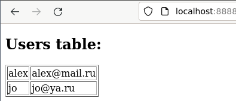

# Vagrant Multi-Node
В данной практике рассмотрим такие функции [vagrant][] как создание собственного
[box][] из развернутой машины, а также создание нескольких машин в одном [Vagrantfile][].

В качестве лабораторного стенда попробуем реализовать простую схему развертывания в
виде трех виртуальных машин: front - машина отдающая статическую html страницу,
back - машина с приложением реализующим бизнес логику, db - машина с базой данных.

## Package
Для удобства развертывания можно на основе базового бокса создать боксы с необходимой
конфигурацией, чтобы не производить подготовку при каждом запуске. Для данной операции
есть команда `vagrant package`, которая создаст и сохранит на файловой системе бокс
из текущей запущенной виртуальной машины.

### Front
Создадим подготовленный бокс для виртуальной машины front, за базовый бокс
возьмем `ubuntu/lunar64` и напишем `Vagrantfile` для установки `nginx`, который
будет отдавать статическую страницу:
```ruby
Vagrant.configure("2") do |config|
  config.vm.box = "ubuntu/lunar64"
  config.vm.provision "shell", inline: <<-SHELL
    apt-get update
    apt-get install -y nginx
  SHELL
end
```

Запустим вм:
```console
$ vagrant up
Bringing machine 'default' up with 'virtualbox' provider...
==> default: Importing base box 'ubuntu/lunar64'...
==> default: Matching MAC address for NAT networking...
==> default: Setting the name of the VM: vagrant2_default_1694453192956_9259
==> default: Clearing any previously set network interfaces...
==> default: Preparing network interfaces based on configuration...
    default: Adapter 1: nat
==> default: Forwarding ports...
    default: 22 (guest) => 2222 (host) (adapter 1)
==> default: Running 'pre-boot' VM customizations...
==> default: Booting VM...
==> default: Waiting for machine to boot. This may take a few minutes...
    default: SSH address: 127.0.0.1:2222
    default: SSH username: vagrant
    default: SSH auth method: private key
==> default: Machine booted and ready!
```

Дополнительно сохраним себе приватный ключ для доступа по ssh к виртуальной машине -
он нам понадобится в дальнейшем, путь к нему указан в параметре `IdentityFile`
в выводе команды `vagrant ssh-config`:
```console
$ vagrant ssh-config | grep IdentityFile
  IdentityFile /home/alex/infra-course/example/vagrant2/vagrant_insecure_key
# сохранить в текущую директорию по именем "key" можно следующей командой
$ vagrant ssh-config | awk '/IdentityFile/{print $2}' | xargs -i cp {} ./key
```

Сохраним бокс на файловую систему и добавим в локальное хранилище:
```console
$ vagrant package --output front.box
==> default: Attempting graceful shutdown of VM...
==> default: Clearing any previously set forwarded ports...
==> default: Exporting VM...
==> default: Compressing package to: /home/alex/infra-course/example/vagrant2/front.box
$ vagrant box add --name front front.box
==> box: Box file was not detected as metadata. Adding it directly...
==> box: Adding box 'front' (v0) for provider:
    box: Unpacking necessary files from: file:///home/alex/infra-course/example/vagrant2/front.box
==> box: Successfully added box 'front' (v0) for 'virtualbox'!
```

После чего уничтожим вм и удалим бокс из файловой системы:
```console
$ vagrant destroy -f
==> default: Forcing shutdown of VM...
==> default: Destroying VM and associated drives...
$ rm front.box
```

### Back
Для виртуальной машины back подготовим среду для работы приложения, для бэкенда
будем использовать язык golang, так что нам понадобится установить пакеты для сборки.
В качестве базового образа также возьмем `ubuntu/lunar64`, напишем `Vagrantfile`:
```ruby
Vagrant.configure("2") do |config|
  config.vm.box = "ubuntu/lunar64"
  config.vm.provision "shell", inline: <<-SHELL
    apt-get update
    apt-get install -y golang
  SHELL
end
```

Проделаем те же действия, что и в предыдущем пункте:
```console
$ vagrant up
Bringing machine 'default' up with 'virtualbox' provider...
==> default: Importing base box 'ubuntu/lunar64'...
==> default: Matching MAC address for NAT networking...
==> default: Setting the name of the VM: vagrant2_default_1694457463073_44923
==> default: Clearing any previously set network interfaces...
==> default: Preparing network interfaces based on configuration...
    default: Adapter 1: nat
==> default: Forwarding ports...
    default: 22 (guest) => 2222 (host) (adapter 1)
==> default: Running 'pre-boot' VM customizations...
==> default: Booting VM...
==> default: Waiting for machine to boot. This may take a few minutes...
    default: SSH address: 127.0.0.1:2222
    default: SSH username: vagrant
    default: SSH auth method: private key
==> default: Machine booted and ready!
$ vagrant package --output back.box
==> default: Attempting graceful shutdown of VM...
==> default: Clearing any previously set forwarded ports...
==> default: Exporting VM...
==> default: Compressing package to: /home/alex/infra-course/example/vagrant2/back.box
$ vagrant box add --name back back.box
==> box: Box file was not detected as metadata. Adding it directly...
==> box: Adding box 'back' (v0) for provider:
    box: Unpacking necessary files from: file:///home/alex/infra-course/example/vagrant2/back.box
==> box: Successfully added box 'back' (v0) for 'virtualbox'!
$ vagrant destroy -f
==> default: Destroying VM and associated drives...
$ rm back.box
```

### DB
Для виртуальной машины с базой данных также используем в качестве базового образа
`ubuntu/lunar64`, в качестве субд возьмем postgresql. Также при подготовке добавим
конфигурацию, которая даст возможность удаленного подключения из любой доступной сети.
Таким образом получим следующее содержание для `Vagrantfile`:
```ruby
Vagrant.configure("2") do |config|
  config.vm.box = "ubuntu/lunar64"
  config.vm.provision "shell", inline: <<-SHELL
    apt-get update
    apt-get install -y postgresql
    echo "listen_addresses = '*'" >> /etc/postgresql/15/main/conf.d/listen.conf
    echo "host all all 0.0.0.0/0 trust" >> /etc/postgresql/15/main/pg_hba.conf
  SHELL
end
```

Проделаем те же действия, что и в предыдущем пункте:
```console
$ vagrant up
Bringing machine 'default' up with 'virtualbox' provider...
==> default: Importing base box 'ubuntu/lunar64'...
==> default: Matching MAC address for NAT networking...
==> default: Setting the name of the VM: vagrant2_default_1694458609907_72643
==> default: Clearing any previously set network interfaces...
==> default: Preparing network interfaces based on configuration...
    default: Adapter 1: nat
==> default: Forwarding ports...
    default: 22 (guest) => 2222 (host) (adapter 1)
==> default: Running 'pre-boot' VM customizations...
==> default: Booting VM...
==> default: Waiting for machine to boot. This may take a few minutes...
    default: SSH address: 127.0.0.1:2222
    default: SSH username: vagrant
    default: SSH auth method: private key
==> default: Machine booted and ready!
$ vagrant package --output db.box
==> default: Attempting graceful shutdown of VM...
==> default: Clearing any previously set forwarded ports...
==> default: Exporting VM...
==> default: Compressing package to: /home/alex/infra-course/example/vagrant2/db.box
$ vagrant box add --name db db.box
==> box: Box file was not detected as metadata. Adding it directly...
==> box: Adding box 'db' (v0) for provider:
    box: Unpacking necessary files from: file:///home/alex/infra-course/example/vagrant2/db.box
==> box: Successfully added box 'db' (v0) for 'virtualbox'!
$ vagrant destroy -f
==> default: Destroying VM and associated drives...
$ rm db.box
```

## Multi-Node
После проделанных действий у нас появилось еще 3 бокса:
```console
$ vagrant box list
back           (virtualbox, 0)
db             (virtualbox, 0)
front          (virtualbox, 0)
ubuntu/lunar64 (virtualbox, 0)
```

Теперь имея боксы для разных виртуальных машин можно позаботиться их наполнением.

### Code
Опишем программный код, который будет деплоиться на каждую машину.

#### Front
На виртуальной машине front мы будем отдавать статичную `html` страницу с простым
`js` скриптом, сохраним его в файл `index.html`:
```html
<!DOCTYPE html>
<html>
<body>

<h2>Users table:</h2>

<p id="users"></p>

<script>
var req = function() {
  var http = new XMLHttpRequest();
  http.onload = function() {
    const users = JSON.parse(this.responseText);
    let text = "<table border='1'>"
    for (let x in users) {
      text += "<tr><td>" + users[x].name + "</td>";
      text += "<td>" + users[x].email + "</td></tr>";
    }
    text += "</table>"
    document.getElementById("users").innerHTML = text;
  }

  http.open("GET", "http://localhost:8889");
  http.send();
}
setInterval(req, 1000);
</script>

</body>
</html>
```

#### Back
На виртуальной машине back соберем приложение на `golang`, которое будет подключаться
к базе данных и отдавать список пользователей из базы в виде `json` по `http`.
Опишем это в файле `main.go`:
```go
package main

import (
        "context"
        "encoding/json"
        "fmt"
        "net/http"
        "os"

        "github.com/jackc/pgx/v5"
)

type users struct {
        ID    int    `json:"id"`
        Name  string `json:"name"`
        Email string `json:"email"`
}

func main() {
        ctx := context.Background()
        conn, err := pgx.Connect(ctx, "postgres://app:pass@db:5432/app?sslmode=disable")
        if err != nil {
                fmt.Fprintf(os.Stderr, "Unable to connect to database: %v\n", err)
                os.Exit(1)
        }
        defer conn.Close(ctx)

        http.ListenAndServe("0.0.0.0:80", http.HandlerFunc(
                func(w http.ResponseWriter, r *http.Request) {
                        rows, err := conn.Query(ctx, "select * from users")
                        if err != nil {
                                fmt.Printf("error db query: %s", err)
                                return
                        }

                        users, err := pgx.CollectRows(rows, pgx.RowToStructByName[users])
                        if err != nil {
                                fmt.Printf("error collect rows: %s", err)
                                return
                        }

                        jsonUsers, err := json.Marshal(users)
                        if err != nil {
                                fmt.Printf("error marshal json: %s", err)
                        }

                        w.Header().Add("Access-Control-Allow-Origin", "*")
                        w.Write(jsonUsers)
                }),
        )
}
```

#### DB
На виртуальной машине db подготовим пользователя, базу и таблицу. Для этого опишем
файл `users.sql`:
```psql
create database app;
create user app;
grant all on database app to app;
\connect app;
create table users(
  id serial primary key,
  name varchar(50),
  email varchar(100)
);
grant all on all tables in schema public to app;
```

### Vagrantfile
Опишем подготовку виртуальных машин в `Vagrantfile`:
```ruby
Vagrant.configure("2") do |config|
  config.ssh.private_key_path = "key"
  config.vm.define "db" do |c|
    c.vm.box = "db"
    c.vm.network "private_network", ip: "192.168.56.30"
    c.vm.provision "shell", inline: <<-SHELL
      su - postgres -c 'psql -f /vagrant/users.sql'
      echo 192.168.56.10 front >> /etc/hosts
      echo 192.168.56.20 back >> /etc/hosts
      echo 192.168.56.30 db >> /etc/hosts
    SHELL
  end

  config.vm.define "front" do |c|
    c.vm.box = "front"
    c.vm.network "forwarded_port", guest: 80, host: 8888
    c.vm.network "private_network", ip: "192.168.56.10"
    c.vm.provision "shell", inline: <<-SHELL
      cat /vagrant/index.html > /var/www/html/index.html
      echo 192.168.56.10 front >> /etc/hosts
      echo 192.168.56.20 back >> /etc/hosts
      echo 192.168.56.30 db >> /etc/hosts
    SHELL
  end

  config.vm.define "back" do |c|
    c.vm.box = "back"
    c.vm.network "forwarded_port", guest: 80, host: 8889
    c.vm.network "private_network", ip: "192.168.56.20"
    c.vm.provision "shell", inline: <<-SHELL
      echo 192.168.56.10 front >> /etc/hosts
      echo 192.168.56.20 back >> /etc/hosts
      echo 192.168.56.30 db >> /etc/hosts
      cp /vagrant/main.go /home/vagrant/
      cd /home/vagrant/
      go mod init example
      go mod tidy
      go build main.go
      /home/vagrant/main &
    SHELL
  end
end
```

### UP
После всех операций содержимое директории будет выглядеть так:
```console
$ ls
index.html  key  main.go  users.sql  Vagrantfile
```

Теперь можем запустить команду `vagrant up`:
```console
$ vagrant up
Bringing machine 'db' up with 'virtualbox' provider...
Bringing machine 'front' up with 'virtualbox' provider...
Bringing machine 'back' up with 'virtualbox' provider...
...
==> back: Running provisioner: shell...
    back: Running: inline script
    back: go: creating new go.mod: module example
    back: go: to add module requirements and sums:
    back:       go mod tidy
    back: go: finding module for package github.com/jackc/pgx/v5
    back: go: downloading github.com/jackc/pgx/v5 v5.4.3
    back: go: downloading github.com/jackc/pgx v3.6.2+incompatible
    back: go: found github.com/jackc/pgx/v5 in github.com/jackc/pgx/v5 v5.4.3
    back: go: downloading github.com/stretchr/testify v1.8.1
    back: go: downloading github.com/jackc/pgpassfile v1.0.0
    back: go: downloading github.com/jackc/pgservicefile v0.0.0-20221227161230-091c0ba34f0a
    back: go: downloading golang.org/x/crypto v0.9.0
    back: go: downloading golang.org/x/text v0.9.0
    back: go: downloading github.com/davecgh/go-spew v1.1.1
    back: go: downloading github.com/pmezard/go-difflib v1.0.0
    back: go: downloading gopkg.in/yaml.v3 v3.0.1
```

После чего можно открыть страницу [http://localhost:8888](http://localhost:8888) и
убедиться, что она работает:


Добавим пару пользователей в нашу базу:
```console
$ vagrant ssh db -c 'sudo -u postgres psql'
could not change directory to "/home/vagrant": Permission denied
psql (15.4 (Ubuntu 15.4-0ubuntu0.23.04.1))
Type "help" for help.

postgres=# \c app
You are now connected to database "app" as user "postgres".
app=# insert into users (name,email) values ('alex', 'alex@mail.ru');
INSERT 0 1
app=# insert into users (name,email) values ('jo', 'jo@ya.ru');
INSERT 0 1
\q
```

После чего можно убедиться, что они попали на наш фронтенд:


После того как мы убедились, что связка наших виртуальных машин с приложениями на них
функционирует как ожидается, можно уничтожить данный стенд:
```console
$ vagrant destroy -f
==> back: Forcing shutdown of VM...
==> back: Destroying VM and associated drives...
==> front: Forcing shutdown of VM...
==> front: Destroying VM and associated drives...
==> db: Forcing shutdown of VM...
==> db: Destroying VM and associated drives...
```

[vagrant]:https://www.vagrantup.com/
[box]:https://developer.hashicorp.com/vagrant/docs/boxes
[vagrantfile]:https://developer.hashicorp.com/vagrant/docs/vagrantfile
