# ELK Log Visualization
В данном практическом занятии рассмотрим возможности визуализации логов собственного
приложения используя [ELK][] стек.

## Vagrant
Для работы будем использовать следующий `Vagrantfile`:
```ruby
Vagrant.configure("2") do |config|
  config.vm.define "logging" do |c|
    c.vm.provider "virtualbox" do |v|
      v.cpus = 2
      v.memory = 4096
    end
    c.vm.box = "ubuntu/lunar64"
    c.vm.hostname = "logging"
    c.vm.network "forwarded_port", guest: 8888, host: 8888
    c.vm.network "forwarded_port", guest: 8889, host: 8889
    c.vm.provision "shell", inline: <<-SHELL
      apt-get update -q
      apt-get install -yq docker.io docker-compose-v2
      usermod -a -G docker vagrant
    SHELL
  end
end
```
Данная конфигурация установит на виртуальную машину [docker][] и
[docker compose][docker-compose], с помощью которых в дальнейшем будут
развернуты остальные компоненты.

## Application
Создадим простое приложение `main.go` на [golang][] для отправки логов по протоколу
[syslog][] в формате `json`:
```golang
package main

import (
        "io"
        "log/slog"
        "log/syslog"
        "math/rand"
        "net/http"
        "os"
        "time"
)

func main() {
        logstash, err := syslog.Dial("udp", "logstash:5044", syslog.LOG_INFO, "test")
        if err != nil {
                slog.Error("error syslog dial", "error", err)
                return
        }
        slog.SetDefault(slog.New(slog.NewJSONHandler(io.MultiWriter(os.Stdout, logstash), nil)))
        slog.Info("start")

        http.Handle("/", http.HandlerFunc(func(w http.ResponseWriter, r *http.Request) {
                start := time.Now()
                if rand.Intn(10) > 0 {
                        w.WriteHeader(200)
                        w.Write([]byte("OK\n"))
                        slog.Info("OK", "user", r.UserAgent(), "path", r.URL.Path, "duration", time.Since(start), "code", 200)

                        return
                }

                w.WriteHeader(500)
                w.Write([]byte("NE OK\n"))
                slog.Error("NE OK", "user", r.UserAgent(), "path", r.URL.Path,  "duration", time.Since(start),"code", 500)
        }))

        http.ListenAndServe(":8080", nil)
}
```
Данное приложение принимает http запросы и с некоторой вероятностью возвращает ошибку.
В конце обработки выводится событие в стандартный вывод, а также отправляется
в [logstash][]. Логируются следующий параметры: текст, уровень важности, код возврата,
юзер агент и время обработки. Также добавим к нему `Dockerfile`:
```dockerfile
FROM golang:1.21 as build

WORKDIR /src

COPY main.go /src/main.go
RUN go mod init example \
  && go mod tidy \
  && CGO_ENABLED=0 go build -o /bin/app ./main.go

FROM scratch
COPY --from=build /bin/app /app
CMD ["/app"]
```

## Compose
Опишем компоненты [ELK][] стека для нашего приложения и саму сборку приложения в
`compose.yaml` файле:
```yaml
version: '3'
services:
  elasticsearch:
    image: elasticsearch:7.9.1
    container_name: elasticsearch
    ports:
      - "8889:9200"
      - "9300:9300"
    volumes:
      - test_data:/usr/share/elasticsearch/data/
      - ./elasticsearch.yml:/usr/share/elasticsearch/config/elasticsearch.yml
    environment:
      - discovery.type=single-node
      - http.host=0.0.0.0
      - transport.host=0.0.0.0
      - xpack.security.enabled=false
      - xpack.monitoring.enabled=false
      - cluster.name=elasticsearch
      - bootstrap.memory_lock=true
      - ES_JAVA_OPTS=-Xms256m -Xmx256m
    networks:
      - elk

  logstash:
    image: logstash:7.9.1
    container_name: logstash
    user: "0"
    ports:
      - "5044:5044/udp"
      - "9600:9600"
    volumes:
      - ./logstash.conf:/usr/share/logstash/pipeline/logstash.conf
      - ./logstash.yml:/usr/share/logstash/config/logstash.yml
      - ls_data:/usr/share/logstash/data
      - /var/lib/docker/containers:/var/lib/docker/containers

    networks:
      - elk
    depends_on:
      - elasticsearch

  kibana:
    image: kibana:7.9.1
    container_name: kibana
    ports:
      - "8888:5601"
    volumes:
      - ./kibana.yml:/usr/share/kibana/config/kibana.yml
      - kb_data:/usr/share/kibana/data
    networks:
      - elk
    depends_on:
      - elasticsearch

  app:
    image: test
    container_name: app
    build: .
    ports:
      - 8080:8080
    networks:
      - elk
    depends_on:
      - logstash

networks:
  elk:
    driver: bridge

volumes:
  test_data:
  ls_data:
  kb_data:
```

А также конфигурации для этих компонентов.

`elasticsearch.yml`:
```yaml
cluster.name: "elasticsearch"
network.host: localhost
```

`logstash.yml`:
```yaml
http.host: 0.0.0.0
xpack.monitoring.elasticsearch.hosts: ["http://elasticsearch:9200"]
```

`kibana.yml`:
```yaml
server.name: kibana
server.host: "0"
elasticsearch.hosts: [ "http://elasticsearch:9200" ]
monitoring.ui.container.elasticsearch.enabled: true
```

`logstash.conf`:
```yaml
input {
  syslog {
    port => 5044
  }
}

filter {
  json {
    source => "message"
  }
  mutate {
    remove_field => ["message"]
  }
}

output {
   elasticsearch {
   hosts => "http://elasticsearch:9200"
   index => "test-logs-%{+YYYY.MM.DD}"
  }
}
```

После чего запустим:
```console
$ docker compose up -d
[+] Running 8/8
 ✔ Network vagrant_elk         Created                                                 0.0s
 ✔ Volume "vagrant_ls_data"    Created                                                 0.0s
 ✔ Volume "vagrant_kb_data"    Created                                                 0.0s
 ✔ Volume "vagrant_test_data"  Created                                                 0.0s
 ✔ Container elasticsearch     Started                                                 0.4s
 ✔ Container logstash          Started                                                 0.9s
 ✔ Container kibana            Started                                                 0.9s
 ✔ Container app               Started                                                 1.2s
```

## Visualization
Проверим работу нашего приложения отправив запрос:
```console
$ curl localhost:8080
OK
$ docker logs app
{"time":"2024-03-31T18:15:30.382334348Z","level":"INFO","msg":"start"}
{"time":"2024-03-31T18:50:27.186771729Z","level":"INFO","msg":"OK","user":"curl/7.88.1","path":"/","duration":7103,"code":200}
```

И посмотрим результат в `kibana` на странице
[/app/discover](http://localhost:8888/app/discover), первоначально создав index pattern:


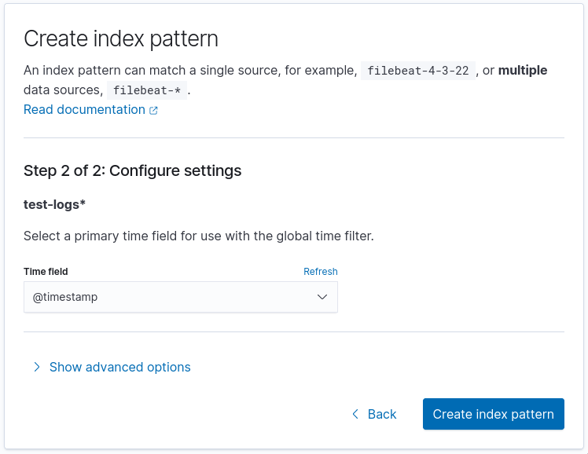

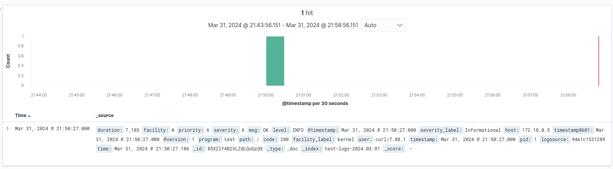

Запустим цикл запросов для генерации логов:
```console
$ while sleep 1;do curl -H "user-agent: user$(($RANDOM%10))" localhost:8080/$(($RANDOM%5));done
OK
OK
OK
OK
OK
OK
OK
OK
OK
NE OK
NE OK
OK
...
```
В данном цикле мы указываем случайный `user-agent` от 0 до 9 и путь запрос от 0 до 4.
Выберем в левой панели поля, которые хотим отображать:
`level`, `code`, `msg`, `path`, `user` и `duration`.

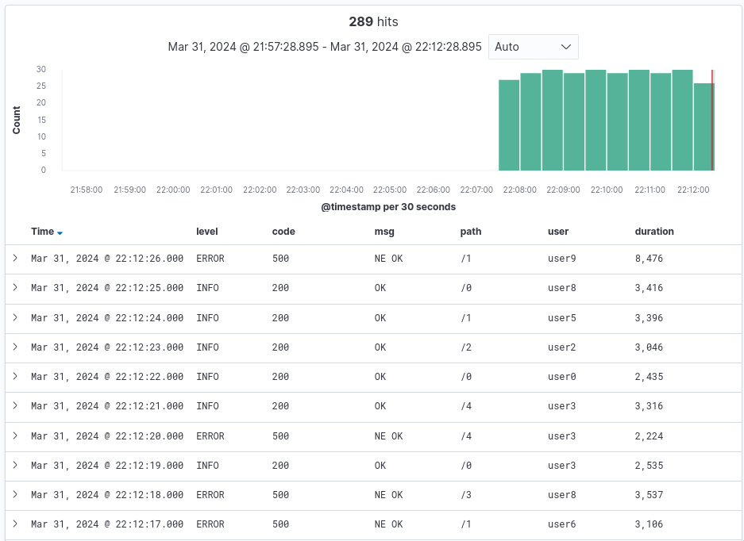

## Dashboard
На странице [/app/dashboards](http://localhost:8888/app/dashboards) можно создать
дашборд с различной визуализацией событий приложения для анализа его работы. Добавим
новый дашборд и новую визуализацию в нем:

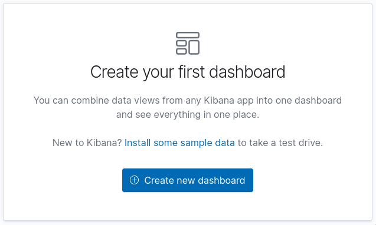
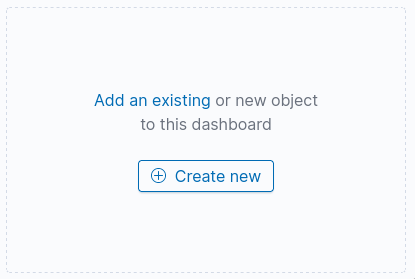

Первую визуализацию добавим типа vertical bar, добавив по оси X - Date Histogram:

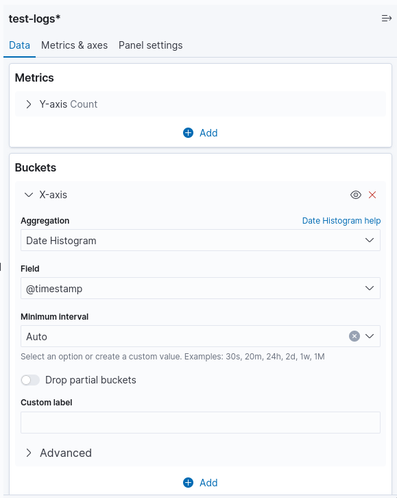

И сохраним:


Далее добавим визуализацию для отображения количества событий по уровням, также
используя vertical bar, также сделав по оси X - Date Histogram, а по оси Y сделаем
агрегации Sum Bucket по уровню логирования:

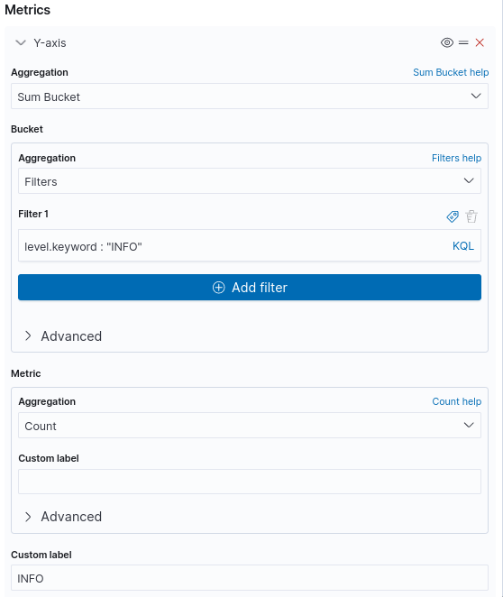 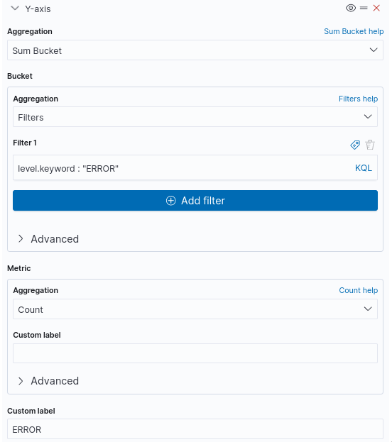

Также добавим понятные цвета и сохраним:

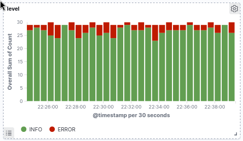

Далее можем отобразить количество сообщений в зависимости от пути запроса,
для этого возьмем data table:


И получим:


Далее добавим визуализацию в виде pie chart по http кодам:


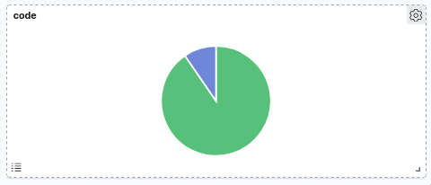

Далее отобразим количество сообщений по разным временам в виде horizontal bar:

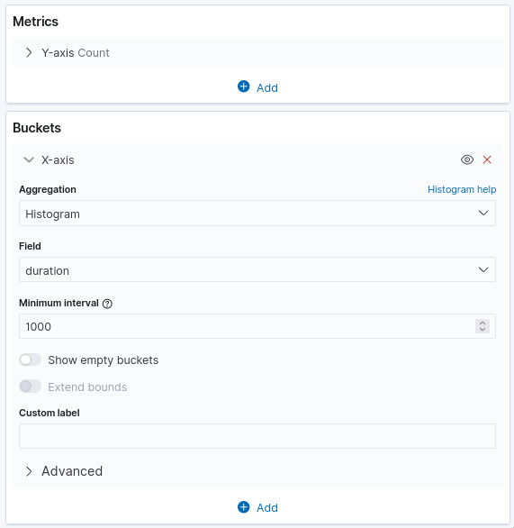


И добавим последнюю визуализацию в виде облака тегов, на котором отобразим какие
встречаются user-agent:


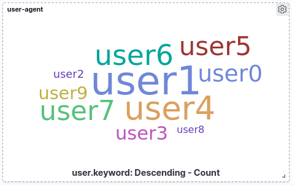

По итогу мы получим дашборд следующего содержимого:

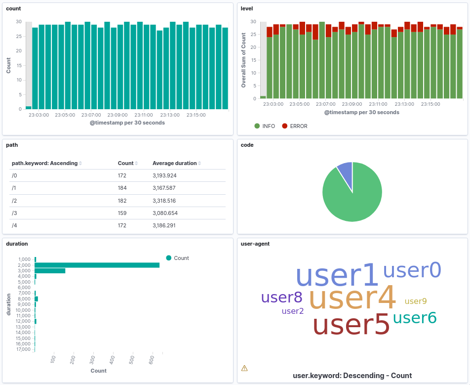

Визуализации позволяют интерактивно менять фильтры кликая по элементам, например,
если кликнуть в pie chart на часть с кодом `500` и в облаке тегов на `user1`,
то получим дашборд отфильтрованный по данным параметрам:

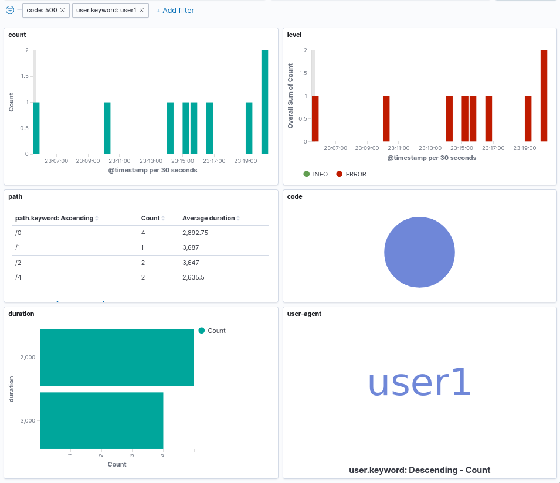


[elk]:https://www.elastic.co/elastic-stack
[golang]:https://go.dev/
[syslog]:https://ru.wikipedia.org/wiki/Syslog
[logstash]:https://www.elastic.co/guide/en/logstash/current/introduction.html
