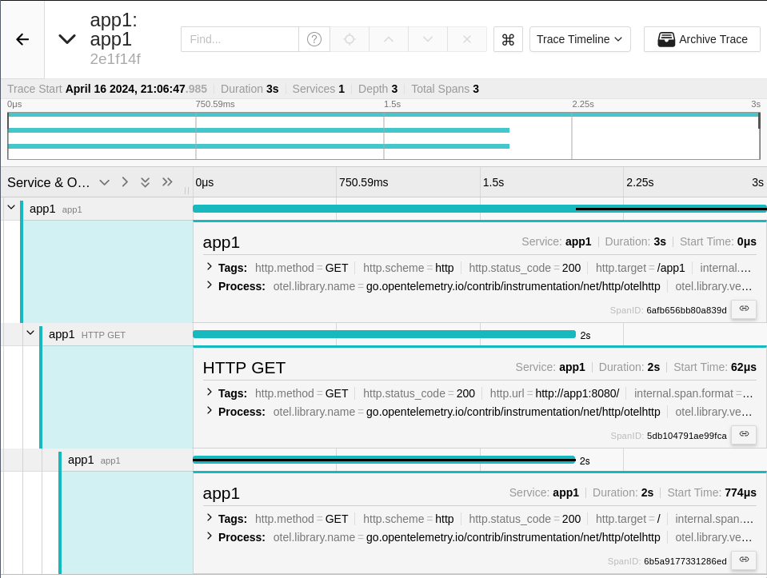
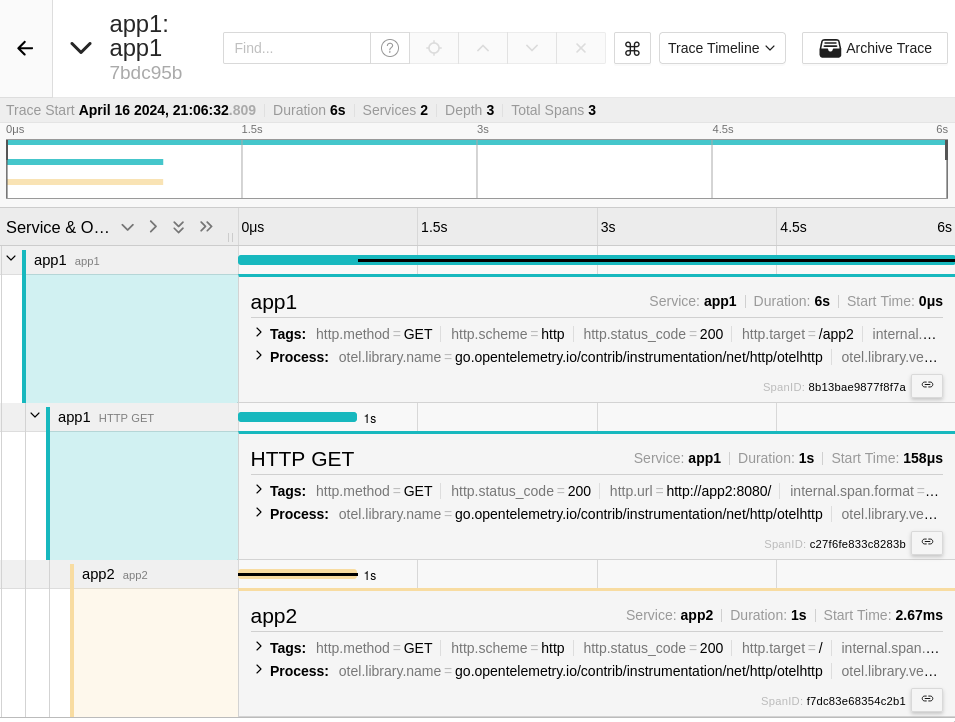
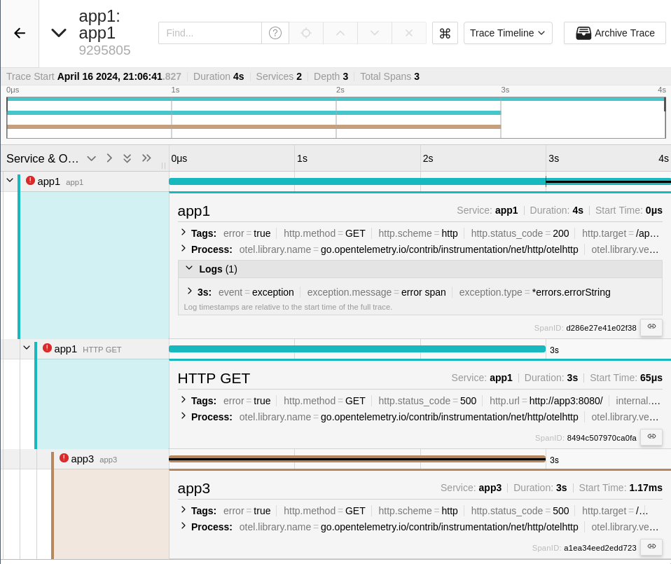
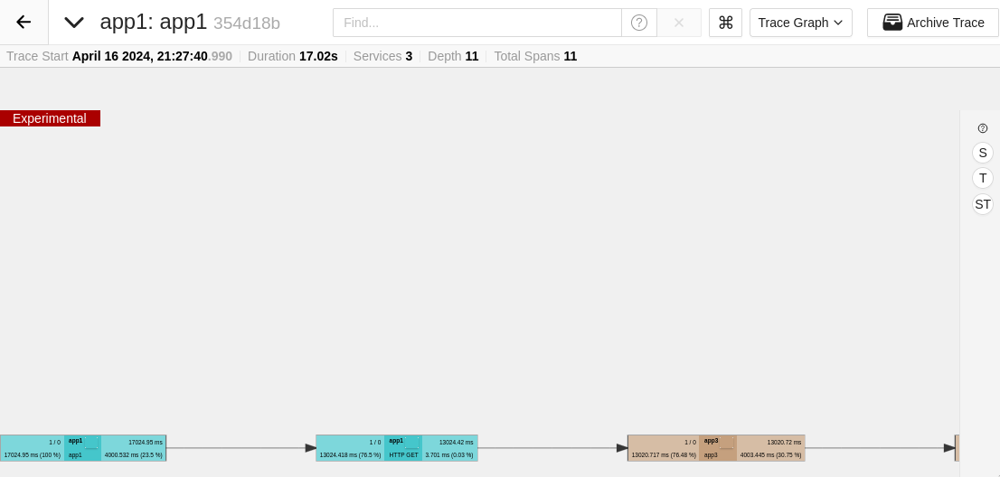

# Jaeger E2E
В данном практическом занятии рассмотрим возможность сквозной трассировки
через несколько приложений с помощью [jaeger][].

## Vagrant
```ruby
Vagrant.configure("2") do |config|
  config.vm.define "jaeger" do |c|
    c.vm.box = "ubuntu/lunar64"
    c.vm.hostname = "jaeger"
    c.vm.network "forwarded_port", guest: 8888, host: 8888
    c.vm.network "forwarded_port", guest: 8889, host: 8889
    c.vm.provision "shell", inline: <<-SHELL
      apt-get update -q
      apt-get install -yq docker.io docker-compose-v2
      usermod -a -G docker vagrant
    SHELL
  end
end
```
Данная конфигурация установит на виртуальную машину [docker][] и
[docker compose][docker-compose], с помощью которых в дальнейшем будут
развернуты остальные компоненты.

Развернем `jaeger` с помощью следующего `compose.yaml`:
```yaml
services:
  jaeger:
    container_name: jaeger
    image: jaegertracing/all-in-one
    ports:
      - "8889:14268"
      - "8888:16686"
```
```console
$ docker compose up -d
[+] Running 2/2
 ✔ Network vagrant_default  Created                                                   0.1s
 ✔ Container jaeger         Started                                                   0.3s
```

После чего по адресу [localhost:8888/search](http://localhost:8888/search) будет
доступен интерфейс.

## Application
Создадим приложение на языке golang для обработки http запросов, которое будет
обрабатывать запрос случайное время и иногда возвращать ошибку. Для инструментирования
http запросов воспользуемся библиотеками [opentelemetry][].
```golang
package main

import (
        "context"
        "fmt"
        "io"
        "log"
        "math/rand"
        "net/http"
        "os"
        "time"

        "go.opentelemetry.io/contrib/instrumentation/net/http/otelhttp"
        "go.opentelemetry.io/otel"
        "go.opentelemetry.io/otel/exporters/otlp/otlptrace/otlptracegrpc"
        "go.opentelemetry.io/otel/propagation"
        "go.opentelemetry.io/otel/sdk/resource"
        sdktrace "go.opentelemetry.io/otel/sdk/trace"
        semconv "go.opentelemetry.io/otel/semconv/v1.24.0"
        "go.opentelemetry.io/otel/trace"
        "google.golang.org/grpc"
        "google.golang.org/grpc/credentials/insecure"
)

func main() {
        service := os.Getenv("NAME")
        ctx := context.Background()

        tr, err := initTracer(ctx, service)
        if err != nil {
                log.Fatal("init tracer", err)
        }

        http.Handle("/", newHandler(service, tr))
        http.ListenAndServe(":8080", nil)
}

func initTracer(ctx context.Context, svc string) (trace.Tracer, error) {
        conn, err := grpc.NewClient("jaeger:4317",
                grpc.WithTransportCredentials(insecure.NewCredentials()),
        )
        if err != nil {
                return nil, err
        }

        exp, err := otlptracegrpc.New(ctx, otlptracegrpc.WithGRPCConn(conn))
        if err != nil {
                return nil, err
        }

        res, err := resource.New(ctx,
                resource.WithAttributes(
                        semconv.ServiceName(svc),
                ),
        )
        if err != nil {
                return nil, err
        }

        prv := sdktrace.NewTracerProvider(
                sdktrace.WithBatcher(exp),
                sdktrace.WithResource(res),
        )

        otel.SetTracerProvider(prv)
        otel.SetTextMapPropagator(propagation.NewCompositeTextMapPropagator(propagation.TraceContext{}, propagation.Baggage{}))

        return prv.Tracer("tracer"), nil
}

func sendReq(ctx context.Context, tr trace.Tracer, url string) error {
        client := http.Client{Transport: otelhttp.NewTransport(http.DefaultTransport)}
        req, err := http.NewRequestWithContext(ctx, http.MethodGet, url, nil)
        if err != nil {
                return err
        }

        resp, err := client.Do(req)
        if err != nil {
                return err
        }

        defer resp.Body.Close()
        io.ReadAll(resp.Body)

        if resp.StatusCode != http.StatusOK {
                return fmt.Errorf("response code: %d", resp.StatusCode)
        }

        return nil
}

func newHandler(name string, tr trace.Tracer) http.Handler {
        return otelhttp.NewHandler(http.HandlerFunc(func(w http.ResponseWriter, r *http.Request) {
                log.Printf("request %s\n", r.URL.Path)

                num := rand.Intn(5) + 1
                time.Sleep(time.Duration(num) * time.Second)
                if num%3 == 0 {
                        w.WriteHeader(http.StatusInternalServerError)
                }
        }), name)
}
```
И `Dockerfile` к нему:
```dockerfile
FROM golang:1.21 as build

WORKDIR /src
COPY . /src/
RUN go mod init test && go mod tidy
RUN CGO_ENABLED=0 go build -o /bin/app ./main.go

FROM scratch
COPY --from=build /bin/app /app
ENTRYPOINT ["/app"]
```
После чего добавим в наш `compose.yaml`:
```yaml
services:
  jaeger:
    container_name: jaeger
    image: jaegertracing/all-in-one
    ports:
      - "8889:14268"
      - "8888:16686"
  app1:
    container_name: app1
    image: app
    build: .
    environment:
      - NAME=app1
    ports:
      - "8080:8080"
```
Запустим и сделаем несколько запросов:
```console
$ docker compose up -d --force-recreate
[+] Running 2/2
 ✔ Container app1    Started                                                          0.6s
 ✔ Container jaeger  Started                                                          0.7s
$ curl localhost:8080
$ curl localhost:8080
$ curl localhost:8080
```

После чего в интерфейсе jaeger сможем наблюдать наши запросы:


Если раскрыть подробную информацию о трейсе, то в ней будет видно дополнительную
информацию, которую автоматически вносит библиотека инструментирования:


## Distributed tracing
Добавим в приложение возможность отправки запросов в другие сервисы, таким образом
что путь в `url` запроса будет указывать в какой сервис пойти далее:
```golang
package main

import (
        "context"
        "fmt"
        "io"
        "log"
        "math/rand"
        "net/http"
        "os"
        "strings"
        "time"

        "go.opentelemetry.io/contrib/instrumentation/net/http/otelhttp"
        "go.opentelemetry.io/otel"
        "go.opentelemetry.io/otel/codes"
        "go.opentelemetry.io/otel/exporters/otlp/otlptrace/otlptracegrpc"
        "go.opentelemetry.io/otel/propagation"
        "go.opentelemetry.io/otel/sdk/resource"
        sdktrace "go.opentelemetry.io/otel/sdk/trace"
        semconv "go.opentelemetry.io/otel/semconv/v1.24.0"
        "go.opentelemetry.io/otel/trace"
        "google.golang.org/grpc"
        "google.golang.org/grpc/credentials/insecure"
)

func main() {
        service := os.Getenv("NAME")
        ctx := context.Background()

        tr, err := initTracer(ctx, service)
        if err != nil {
                log.Fatal("init tracer", err)
        }

        http.Handle("/", newHandler(service, tr))
        http.ListenAndServe(":8080", nil)
}

func initTracer(ctx context.Context, svc string) (trace.Tracer, error) {
        conn, err := grpc.NewClient("jaeger:4317",
                grpc.WithTransportCredentials(insecure.NewCredentials()),
        )
        if err != nil {
                return nil, err
        }

        exp, err := otlptracegrpc.New(ctx, otlptracegrpc.WithGRPCConn(conn))
        if err != nil {
                return nil, err
        }

        res, err := resource.New(ctx,
                resource.WithAttributes(
                        semconv.ServiceName(svc),
                ),
        )
        if err != nil {
                return nil, err
        }

        prv := sdktrace.NewTracerProvider(
                sdktrace.WithBatcher(exp),
                sdktrace.WithResource(res),
        )

        otel.SetTracerProvider(prv)
        otel.SetTextMapPropagator(propagation.NewCompositeTextMapPropagator(propagation.TraceContext{}, propagation.Baggage{}))

        return prv.Tracer("tracer"), nil
}

func sendReq(ctx context.Context, tr trace.Tracer, url string) error {
        client := http.Client{Transport: otelhttp.NewTransport(http.DefaultTransport)}
        req, err := http.NewRequestWithContext(ctx, http.MethodGet, url, nil)
        if err != nil {
                return err
        }

        resp, err := client.Do(req)
        if err != nil {
                return err
        }

        defer resp.Body.Close()
        io.ReadAll(resp.Body)

        if resp.StatusCode != http.StatusOK {
                return fmt.Errorf("response code: %d", resp.StatusCode)
        }

        return nil
}

func newHandler(name string, tr trace.Tracer) http.Handler {
        return otelhttp.NewHandler(http.HandlerFunc(func(w http.ResponseWriter, r *http.Request) {
                ctx := r.Context()
                log.Printf("request %s\n", r.URL.Path)

                path := strings.Split(r.URL.Path, "/")
                if len(path) > 1 && len(path[1]) > 0 {
                        log.Printf("send request to %s\n", path[1])
                        if err := sendReq(ctx, tr,
                                fmt.Sprintf(
                                        "http://%s:8080/%s", path[1], strings.Join(path[2:], "/"),
                                )); err != nil {
                                log.Printf("send request error %s", err)
                                span := trace.SpanFromContext(ctx)
                                span.SetStatus(codes.Error, "error span")
                                span.RecordError(fmt.Errorf("error span"))
                        }
                }

                num := rand.Intn(5) + 1
                time.Sleep(time.Duration(num) * time.Second)
                if num%3 == 0 {
                        w.WriteHeader(http.StatusInternalServerError)
                }
        }), name)
}
```
И добавим несколько сервисов в `compose.yaml`:
```yaml
services:
  jaeger:
    container_name: jaeger
    image: jaegertracing/all-in-one
    ports:
      - "8889:14268"
      - "8888:16686"
  app1:
    container_name: app1
    image: app
    build: .
    environment:
      - NAME=app1
    ports:
      - "8080:8080"
  app2:
    container_name: app2
    image: app
    build: .
    environment:
      - NAME=app2
  app3:
    container_name: app3
    image: app
    build: .
    environment:
      - NAME=app3
```
Запустим с пересборкой и отправим несколько запросов:
```console
$ docker compose up -d --build
[+] Running 4/4
 ✔ Container app2    Started                                                          0.9s
 ✔ Container app3    Started                                                          0.9s
 ✔ Container jaeger  Running                                                          0.0s
 ✔ Container app1    Started                                                          0.9s
$ curl localhost:8080/app2
$ curl localhost:8080/app3
$ curl localhost:8080/app1
```

В интерфейсе jaeger теперь можно наблюдать взаимодействие с несколькими сервисами
в наших трейсах:


В последнем трейсе сервис отправляет запрос сам в себя, так что взаимодействие
происходит только с одним сервисом:



В двух других же можно проследить взаимодействие между сервисами, которые выделяются
разным цветом в трейсе:





Трейс в себе может хранить информацию о сквозном прохождении через любое количество
сервисов. Отправим такой запрос:
```console
$ curl localhost:8080/app3/app2/app1/app2/app3
```
Тогда наш трейс будет выглядеть следующим образом:


На нем видно весь путь прохождения запроса через все сервисы, время обработки каждым,
а также в каком месте возникала ошибка.

Также в правом углу можно переключить на другие варианты визуализации.

Например в виде графа:



Или в виде flamegraph:


Либо общую статистику трейса, которую можно сгруппировать, например, по сервисам:


Таким образом [jaeger][] позволяет детально анализировать прохождение запроса в сложной
распределенной микросервисной архитектуре.


[jaeger]:https://www.jaegertracing.io/docs/1.56/
[docker]:https://docs.docker.com/engine/
[docker-compose]:https://docs.docker.com/compose/
[opentelemetry]:https://opentelemetry.io/
