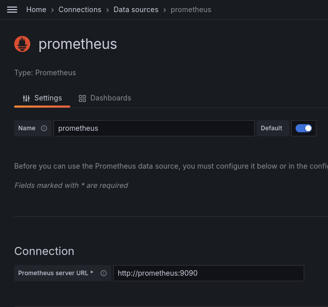
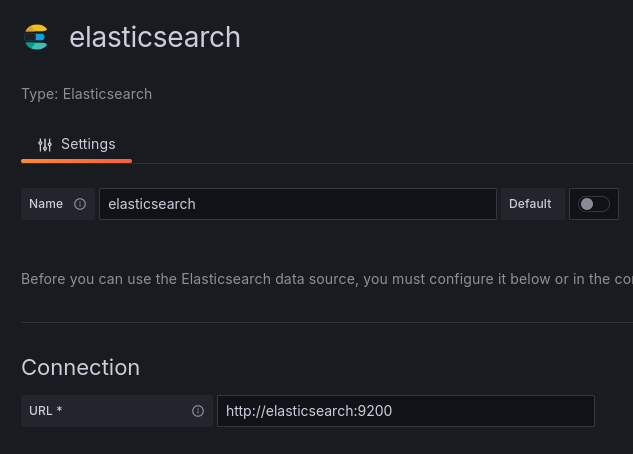
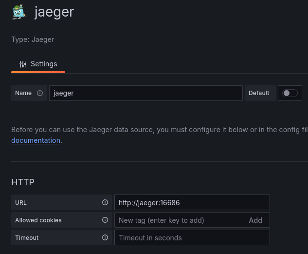
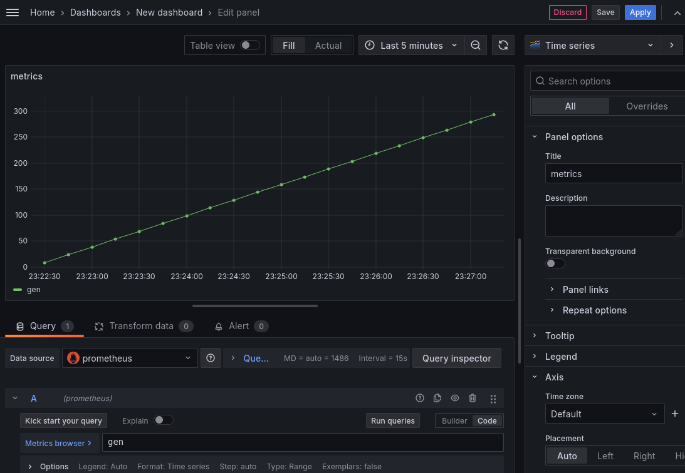
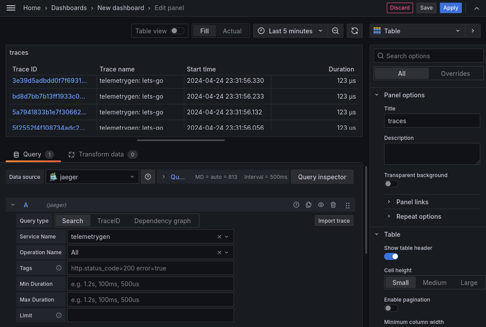
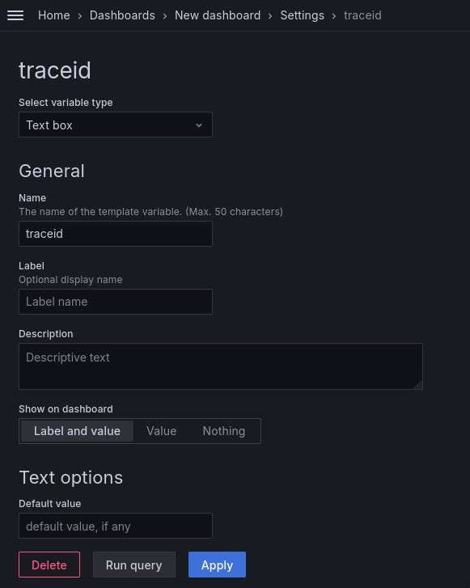
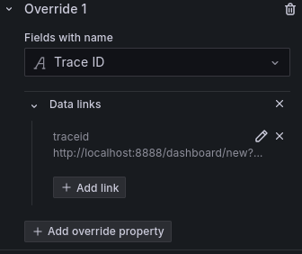
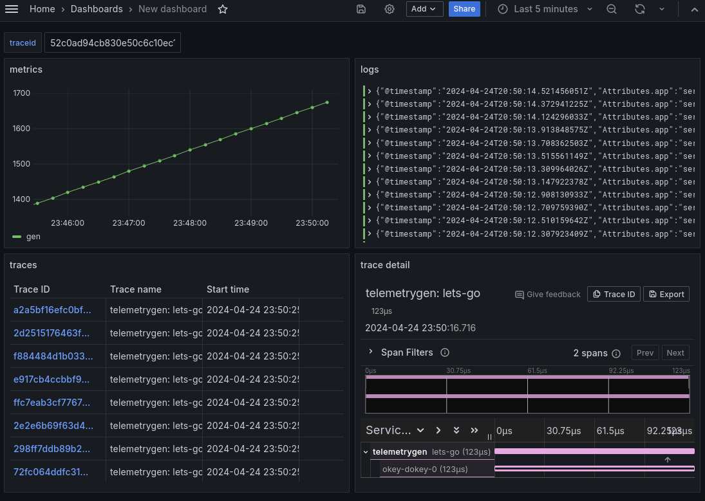

# Opentelemetry Collector
Данное практическое занятие посвящено знакомству с [opentelemetry collector][collector],
с помощью которого можно отправлять метрики, логи и трейсы в различные хранилища для
дальнейшей обработки и анализа.

## Vagrant
Для работы будем использовать следующий `Vagrantfile`:
```ruby
Vagrant.configure("2") do |config|
  config.vm.define "otel" do |c|
    c.vm.provider "virtualbox" do |v|
      v.cpus = 2
      v.memory = 2048
    end
    c.vm.box = "ubuntu/lunar64"
    c.vm.hostname = "otel"
    c.vm.network "forwarded_port", guest: 8888, host: 8888
    c.vm.provision "shell", inline: <<-SHELL
      apt-get update -q
      apt-get install -yq docker.io docker-compose-v2
      usermod -a -G docker vagrant
      docker pull ghcr.io/open-telemetry/opentelemetry-collector-contrib/telemetrygen:latest
      docker inspect ghcr.io/open-telemetry/opentelemetry-collector-contrib/telemetrygen:latest \
        | jq -r '.[0].GraphDriver.Data.UpperDir' \
        | xargs -i sudo cp {}/telemetrygen /usr/local/bin/
    SHELL
  end
end
```

Данная конфигурация установит на виртуальную машину [docker][] и
[docker compose][docker-compose], с помощью которых в дальнейшем будут
развернуты остальные компоненты. А также поставит утилиту [telemetrygen][],
с помощью которой можно будет сгенерировать метрики, логи и трейсы и отправить
в [коллектор][collector].

## Collector
Развернем коллектор при помощи [docker-compose][], для этого зададим для него
конфигурацию в файл `config.yaml`:
```yaml
receivers:
  otlp:
    protocols:
      grpc:
        endpoint: 0.0.0.0:4317

processors:
  batch:

exporters:
  debug:
    verbosity: detailed

service:
  pipelines:
    logs:
      receivers: [otlp]
      processors: [batch]
      exporters: [debug]
    metrics:
      receivers: [otlp]
      processors: [batch]
      exporters: [debug]
    traces:
      receivers: [otlp]
      processors: [batch]
      exporters: [debug]
```
Данная конфигурация позволяет принимать метрики, логи и трейсы по протоколу [otlp][] и
выводить информацию об этом в лог коллектора.
После чего создадим сам файл `compose.yaml`:
```yaml
services:
  otel-collector:
    container_name: collector
    image: otel/opentelemetry-collector-contrib:0.86.0
    ports:
    - 4317:4317
    volumes:
    - ./config.yaml:/etc/otelcol-contrib/config.yaml
```

Запустим и отправим метрику в коллектор утилитой [telemetrygen][], после чего
увидим ее в логах коллектора:
```console
$ docker compose up -d
[+] Running 2/2
 ✔ Network vagrant_default  Created                                                 0.1s
 ✔ Container collector      Started                                                 0.9s
$ telemetrygen metrics --otlp-insecure
2024-04-24T17:09:35.396Z        INFO    metrics/metrics.go:30   starting the metrics generator with configuration        {"config": {"WorkerCount":1,"Rate":0,"TotalDuration":0,"ReportingInterval":1000000000,"SkipSettingGRPCLogger":false,"CustomEndpoint":"","Insecure":true,"UseHTTP":false,"HTTPPath":"/v1/metrics","Headers":{},"ResourceAttributes":{},"TelemetryAttributes":{},"CaFile":"","ClientAuth":{"Enabled":false,"ClientCertFile":"","ClientKeyFile":""},"NumMetrics":1,"MetricType":"Gauge"}}
2024-04-24T17:09:35.396Z        INFO    metrics/metrics.go:81   generation of metrics isn't being throttled
2024-04-24T17:09:35.396Z        INFO    metrics/metrics.go:49   starting gRPC exporter
2024-04-24T17:09:35.397Z        INFO    grpc@v1.63.2/clientconn.go:427  [core][Channel #1]Channel created        {"system": "grpc", "grpc_log": true}
2024-04-24T17:09:35.397Z        INFO    grpc@v1.63.2/clientconn.go:1668 [core][Channel #1]original dial target is: "localhost:4317"      {"system": "grpc", "grpc_log": true}
2024-04-24T17:09:35.397Z        INFO    grpc@v1.63.2/clientconn.go:1675 [core][Channel #1]parsed dial target is: resolver.Target{URL:url.URL{Scheme:"localhost", Opaque:"4317", User:(*url.Userinfo)(nil), Host:"", Path:"", RawPath:"", OmitHost:false, ForceQuery:false, RawQuery:"", Fragment:"", RawFragment:""}}      {"system": "grpc", "grpc_log": true}
2024-04-24T17:09:35.397Z        INFO    grpc@v1.63.2/clientconn.go:1694 [core][Channel #1]fallback to scheme "dns"       {"system": "grpc", "grpc_log": true}
2024-04-24T17:09:35.397Z        INFO    grpc@v1.63.2/clientconn.go:1702 [core][Channel #1]parsed dial target is: dns:///localhost:4317   {"system": "grpc", "grpc_log": true}
2024-04-24T17:09:35.397Z        INFO    grpc@v1.63.2/clientconn.go:1825 [core][Channel #1]Channel authority set to "localhost:4317"      {"system": "grpc", "grpc_log": true}
2024-04-24T17:09:35.397Z        INFO    grpc@v1.63.2/clientconn.go:332  [core][Channel #1]Channel exiting idle mode      {"system": "grpc", "grpc_log": true}
2024-04-24T17:09:35.398Z        INFO    grpc@v1.63.2/resolver_wrapper.go:197    [core][Channel #1]Resolver state updated: {
  "Addresses": [
    {
      "Addr": "127.0.0.1:4317",
      "ServerName": "",
      "Attributes": null,
      "BalancerAttributes": null,
      "Metadata": null
    }
  ],
  "Endpoints": [
    {
      "Addresses": [
        {
          "Addr": "127.0.0.1:4317",
          "ServerName": "",
          "Attributes": null,
          "BalancerAttributes": null,
          "Metadata": null
        }
      ],
      "Attributes": null
    }
  ],
  "ServiceConfig": null,
  "Attributes": null
} (resolver returned new addresses)     {"system": "grpc", "grpc_log": true}
2024-04-24T17:09:35.399Z        INFO    grpc@v1.63.2/balancer_wrapper.go:103    [core][Channel #1]Channel switches to new LB policy "pick_first" {"system": "grpc", "grpc_log": true}
2024-04-24T17:09:35.399Z        INFO    grpc@v1.63.2/balancer_wrapper.go:170    [core][Channel #1 SubChannel #2]Subchannel created       {"system": "grpc", "grpc_log": true}
2024-04-24T17:09:35.399Z        INFO    grpc@v1.63.2/clientconn.go:531  [core][Channel #1]Channel Connectivity change to CONNECTING      {"system": "grpc", "grpc_log": true}
2024-04-24T17:09:35.399Z        INFO    grpc@v1.63.2/clientconn.go:1195 [core][Channel #1 SubChannel #2]Subchannel Connectivity change to CONNECTING     {"system": "grpc", "grpc_log": true}
2024-04-24T17:09:35.399Z        INFO    grpc@v1.63.2/clientconn.go:1310 [core][Channel #1 SubChannel #2]Subchannel picks a new address "127.0.0.1:4317" to connect       {"system": "grpc", "grpc_log": true}
2024-04-24T17:09:35.400Z        INFO    grpc@v1.63.2/clientconn.go:1195 [core][Channel #1 SubChannel #2]Subchannel Connectivity change to READY  {"system": "grpc", "grpc_log": true}
2024-04-24T17:09:35.401Z        INFO    grpc@v1.63.2/clientconn.go:531  [core][Channel #1]Channel Connectivity change to READY   {"system": "grpc", "grpc_log": true}
2024-04-24T17:09:35.402Z        INFO    metrics/worker.go:103   metrics generated       {"worker": 0, "metrics": 1}
$ docker logs collector
2024-04-24T17:07:40.261Z        info    service@v0.86.0/telemetry.go:84 Setting up own telemetry...
2024-04-24T17:07:40.261Z        info    service@v0.86.0/telemetry.go:201        Serving Prometheus metrics      {"address": ":8888", "level": "Basic"}
2024-04-24T17:07:40.261Z        info    exporter@v0.86.0/exporter.go:275        Development component. May change in the future.        {"kind": "exporter", "data_type": "metrics", "name": "debug"}
2024-04-24T17:07:40.262Z        info    exporter@v0.86.0/exporter.go:275        Development component. May change in the future.        {"kind": "exporter", "data_type": "logs", "name": "debug"}
2024-04-24T17:07:40.262Z        info    exporter@v0.86.0/exporter.go:275        Development component. May change in the future.        {"kind": "exporter", "data_type": "traces", "name": "debug"}
2024-04-24T17:07:40.262Z        info    service@v0.86.0/service.go:138  Starting otelcol-contrib...     {"Version": "0.86.0", "NumCPU": 2}
2024-04-24T17:07:40.262Z        info    extensions/extensions.go:31     Starting extensions...
2024-04-24T17:07:40.263Z        warn    internal@v0.86.0/warning.go:40  Using the 0.0.0.0 address exposes this server to every network interface, which may facilitate Denial of Service attacks       {"kind": "receiver", "name": "otlp", "data_type": "metrics", "documentation": "https://github.com/open-telemetry/opentelemetry-collector/blob/main/docs/security-best-practices.md#safeguards-against-denial-of-service-attacks"}
2024-04-24T17:07:40.263Z        info    otlpreceiver@v0.86.0/otlp.go:83 Starting GRPC server    {"kind": "receiver", "name": "otlp", "data_type": "metrics", "endpoint": "0.0.0.0:4317"}
2024-04-24T17:07:40.263Z        info    service@v0.86.0/service.go:161  Everything is ready. Begin running and processing data.
2024-04-24T17:09:35.531Z        info    MetricsExporter {"kind": "exporter", "data_type": "metrics", "name": "debug", "resource metrics": 1, "metrics": 1, "data points": 1}
2024-04-24T17:09:35.531Z        info    ResourceMetrics #0
Resource SchemaURL: https://opentelemetry.io/schemas/1.13.0
ScopeMetrics #0
ScopeMetrics SchemaURL:
InstrumentationScope
Metric #0
Descriptor:
     -> Name: gen
     -> Description:
     -> Unit:
     -> DataType: Gauge
NumberDataPoints #0
StartTimestamp: 1970-01-01 00:00:00 +0000 UTC
Timestamp: 2024-04-24 17:09:35.397178162 +0000 UTC
Value: 0
        {"kind": "exporter", "data_type": "metrics", "name": "debug"}
```

## Metrics
Развернем [prometheus][] для хранения метрик и сконфигурируем [коллектор][collector]
для отправки метрик в него. Таким образом `config.yaml` будет выглядеть так:
```yaml
receivers:
  otlp:
    protocols:
      grpc:
        endpoint: 0.0.0.0:4317

processors:
  batch:

exporters:
  debug:
    verbosity: detailed
  prometheusremotewrite:
    endpoint: http://prometheus:9090/api/v1/write

service:
  pipelines:
    logs:
      receivers: [otlp]
      processors: [batch]
      exporters: [debug]
    metrics:
      receivers: [otlp]
      processors: [batch]
      exporters: [prometheusremotewrite,debug]
    traces:
      receivers: [otlp]
      processors: [batch]
      exporters: [debug]
```
Также добавим [prometheus][] в `compose.yaml`:
```yaml
services:
  otel-collector:
    container_name: collector
    image: otel/opentelemetry-collector-contrib:0.86.0
    ports:
    - 4317:4317
    volumes:
    - ./config.yaml:/etc/otelcol-contrib/config.yaml
  prometheus:
    container_name: prometheus
    image: prom/prometheus:v2.50.1
    command:
    - --config.file=/etc/prometheus/prometheus.yml
    - --storage.tsdb.path=/prometheus
    - --web.enable-remote-write-receiver
    ports:
      - 9090:9090
```
После чего запустим, отправим метрику и посмотрим через api [prometheus][]:
```console
$ docker compose up -d --force-recreate
[+] Running 2/2
 ✔ Container collector   Started                                                    0.6s
 ✔ Container prometheus  Started                                                    0.6s
$ telemetrygen metrics --otlp-insecure --telemetry-attributes 'test_key="test_value"'
2024-04-24T17:44:47.846Z        INFO    metrics/metrics.go:30   starting the metrics generator with configuration       {"config": {"WorkerCount":1,"Rate":0,"TotalDuration":0,"ReportingInterval":1000000000,"SkipSettingGRPCLogger":false,"CustomEndpoint":"","Insecure":true,"UseHTTP":false,"HTTPPath":"/v1/metrics","Headers":{},"ResourceAttributes":{},"TelemetryAttributes":{"test_key":"test_value"},"CaFile":"","ClientAuth":{"Enabled":false,"ClientCertFile":"","ClientKeyFile":""},"NumMetrics":1,"MetricType":"Gauge"}}
2024-04-24T17:44:47.849Z        INFO    metrics/metrics.go:81   generation of metrics isn't being throttled
2024-04-24T17:44:47.851Z        INFO    metrics/metrics.go:49   starting gRPC exporter
2024-04-24T17:44:47.853Z        INFO    grpc@v1.63.2/clientconn.go:427  [core][Channel #1]Channel created       {"system": "grpc", "grpc_log": true}
2024-04-24T17:44:47.855Z        INFO    grpc@v1.63.2/clientconn.go:1668 [core][Channel #1]original dial target is: "localhost:4317"     {"system": "grpc", "grpc_log": true}
2024-04-24T17:44:47.857Z        INFO    grpc@v1.63.2/clientconn.go:1675 [core][Channel #1]parsed dial target is: resolver.Target{URL:url.URL{Scheme:"localhost", Opaque:"4317", User:(*url.Userinfo)(nil), Host:"", Path:"", RawPath:"", OmitHost:false, ForceQuery:false, RawQuery:"", Fragment:"", RawFragment:""}}  {"system": "grpc", "grpc_log": true}
2024-04-24T17:44:47.859Z        INFO    grpc@v1.63.2/clientconn.go:1694 [core][Channel #1]fallback to scheme "dns"      {"system": "grpc", "grpc_log": true}
2024-04-24T17:44:47.861Z        INFO    grpc@v1.63.2/clientconn.go:1702 [core][Channel #1]parsed dial target is: dns:///localhost:4317  {"system": "grpc", "grpc_log": true}
2024-04-24T17:44:47.863Z        INFO    grpc@v1.63.2/clientconn.go:1825 [core][Channel #1]Channel authority set to "localhost:4317"     {"system": "grpc", "grpc_log": true}
2024-04-24T17:44:47.866Z        INFO    grpc@v1.63.2/clientconn.go:332  [core][Channel #1]Channel exiting idle mode     {"system": "grpc", "grpc_log": true}
2024-04-24T17:44:47.866Z        INFO    grpc@v1.63.2/resolver_wrapper.go:197    [core][Channel #1]Resolver state updated: {
  "Addresses": [
    {
      "Addr": "127.0.0.1:4317",
      "ServerName": "",
      "Attributes": null,
      "BalancerAttributes": null,
      "Metadata": null
    }
  ],
  "Endpoints": [
    {
      "Addresses": [
        {
          "Addr": "127.0.0.1:4317",
          "ServerName": "",
          "Attributes": null,
          "BalancerAttributes": null,
          "Metadata": null
        }
      ],
      "Attributes": null
    }
  ],
  "ServiceConfig": null,
  "Attributes": null
} (resolver returned new addresses)     {"system": "grpc", "grpc_log": true}
2024-04-24T17:44:47.871Z        INFO    grpc@v1.63.2/balancer_wrapper.go:103    [core][Channel #1]Channel switches to new LB policy "pick_first"        {"system": "grpc", "grpc_log": true}
2024-04-24T17:44:47.871Z        INFO    grpc@v1.63.2/balancer_wrapper.go:170    [core][Channel #1 SubChannel #2]Subchannel created      {"system": "grpc", "grpc_log": true}
2024-04-24T17:44:47.872Z        INFO    grpc@v1.63.2/clientconn.go:531  [core][Channel #1]Channel Connectivity change to CONNECTING     {"system": "grpc", "grpc_log": true}
2024-04-24T17:44:47.872Z        INFO    grpc@v1.63.2/clientconn.go:1195 [core][Channel #1 SubChannel #2]Subchannel Connectivity change to CONNECTING    {"system": "grpc", "grpc_log": true}
2024-04-24T17:44:47.872Z        INFO    grpc@v1.63.2/clientconn.go:1310 [core][Channel #1 SubChannel #2]Subchannel picks a new address "127.0.0.1:4317" to connect      {"system": "grpc", "grpc_log": true}
2024-04-24T17:44:47.874Z        INFO    grpc@v1.63.2/clientconn.go:1195 [core][Channel #1 SubChannel #2]Subchannel Connectivity change to READY {"system": "grpc", "grpc_log": true}
2024-04-24T17:44:47.874Z        INFO    grpc@v1.63.2/clientconn.go:531  [core][Channel #1]Channel Connectivity change to READY  {"system": "grpc", "grpc_log": true}
2024-04-24T17:44:47.875Z        INFO    metrics/worker.go:103   metrics generated       {"worker": 0, "metrics": 1}
2024-04-24T17:44:47.875Z        INFO    metrics/worker.go:41    stopping the exporter   {"worker": 0}
$ curl -s localhost:9090/api/v1/query?query=gen | jq
{
  "status": "success",
  "data": {
    "resultType": "vector",
    "result": [
      {
        "metric": {
          "__name__": "gen"
        },
        "value": [
          1713980703.106,
          "0"
        ]
      },
      {
        "metric": {
          "__name__": "gen",
          "test_key": "test_value"
        },
        "value": [
          1713980703.106,
          "0"
        ]
      }
    ]
  }
}
```

## Logs
Для хранения логов развернем [elasticsearch][] и сконфигурируем коллектор следующим
образом:
```yaml
receivers:
  otlp:
    protocols:
      grpc:
        endpoint: 0.0.0.0:4317

processors:
  batch:

exporters:
  debug:
    verbosity: detailed
  prometheusremotewrite:
    endpoint: http://prometheus:9090/api/v1/write
  elasticsearch:
    endpoints: [http://elasticsearch:9200]
    logs_index: my-log-index

service:
  pipelines:
    logs:
      receivers: [otlp]
      processors: [batch]
      exporters: [elasticsearch,debug]
    metrics:
      receivers: [otlp]
      processors: [batch]
      exporters: [prometheusremotewrite,debug]
    traces:
      receivers: [otlp]
      processors: [batch]
      exporters: [debug]
```
И добавим [elastic][elasticsearch] в `compose.yaml`:
```yaml
services:
  otel-collector:
    container_name: collector
    image: otel/opentelemetry-collector-contrib:0.86.0
    ports:
    - 4317:4317
    volumes:
    - ./config.yaml:/etc/otelcol-contrib/config.yaml
  prometheus:
    container_name: prometheus
    image: prom/prometheus:v2.50.1
    command:
    - --config.file=/etc/prometheus/prometheus.yml
    - --storage.tsdb.path=/prometheus
    - --web.enable-remote-write-receiver
    ports:
      - 9090:9090
  elasticsearch:
    image: elasticsearch:8.13.0
    container_name: elasticsearch
    ports:
      - "9200:9200"
    environment:
      - discovery.type=single-node
      - http.host=0.0.0.0
      - transport.host=0.0.0.0
      - xpack.security.enabled=false
      - cluster.name=elasticsearch
      - bootstrap.memory_lock=true
      - ES_JAVA_OPTS=-Xms256m -Xmx256m
```
После запустим и попробуем отправить логи через коллектор, а также посмотреть их
через api [elasticsearch][]:
```console
$ docker compose up -d --force-recreate
[+] Running 3/3
 ✔ Container collector      Started                                                 3.1s
 ✔ Container prometheus     Started                                                 3.0s
 ✔ Container elasticsearch  Started                                                 3.1s
$ telemetrygen logs --otlp-insecure
2024-04-24T18:00:03.576Z        INFO    grpc@v1.63.2/clientconn.go:427  [core][Channel #1]Channel created        {"system": "grpc", "grpc_log": true}
2024-04-24T18:00:03.576Z        INFO    grpc@v1.63.2/clientconn.go:1668 [core][Channel #1]original dial target is: "localhost:4317"      {"system": "grpc", "grpc_log": true}
2024-04-24T18:00:03.576Z        INFO    grpc@v1.63.2/clientconn.go:1675 [core][Channel #1]parsed dial target is: resolver.Target{URL:url.URL{Scheme:"localhost", Opaque:"4317", User:(*url.Userinfo)(nil), Host:"", Path:"", RawPath:"", OmitHost:false, ForceQuery:false, RawQuery:"", Fragment:"", RawFragment:""}}      {"system": "grpc", "grpc_log": true}
2024-04-24T18:00:03.576Z        INFO    grpc@v1.63.2/clientconn.go:1694 [core][Channel #1]fallback to scheme "dns"       {"system": "grpc", "grpc_log": true}
2024-04-24T18:00:03.576Z        INFO    grpc@v1.63.2/clientconn.go:1702 [core][Channel #1]parsed dial target is: dns:///localhost:4317   {"system": "grpc", "grpc_log": true}
2024-04-24T18:00:03.576Z        INFO    grpc@v1.63.2/clientconn.go:1825 [core][Channel #1]Channel authority set to "localhost:4317"      {"system": "grpc", "grpc_log": true}
2024-04-24T18:00:03.576Z        INFO    logs/logs.go:52 generation of logs isn't being throttled
2024-04-24T18:00:03.580Z        INFO    grpc@v1.63.2/resolver_wrapper.go:197    [core][Channel #1]Resolver state updated: {
  "Addresses": [
    {
      "Addr": "127.0.0.1:4317",
      "ServerName": "",
      "Attributes": null,
      "BalancerAttributes": null,
      "Metadata": null
    }
  ],
  "Endpoints": [
    {
      "Addresses": [
        {
          "Addr": "127.0.0.1:4317",
          "ServerName": "",
          "Attributes": null,
          "BalancerAttributes": null,
          "Metadata": null
        }
      ],
      "Attributes": null
    }
  ],
  "ServiceConfig": null,
  "Attributes": null
} (resolver returned new addresses)     {"system": "grpc", "grpc_log": true}
2024-04-24T18:00:03.580Z        INFO    grpc@v1.63.2/balancer_wrapper.go:103    [core][Channel #1]Channel switches to new LB policy "pick_first" {"system": "grpc", "grpc_log": true}
2024-04-24T18:00:03.581Z        INFO    grpc@v1.63.2/balancer_wrapper.go:170    [core][Channel #1 SubChannel #2]Subchannel created       {"system": "grpc", "grpc_log": true}
2024-04-24T18:00:03.581Z        INFO    grpc@v1.63.2/clientconn.go:531  [core][Channel #1]Channel Connectivity change to CONNECTING      {"system": "grpc", "grpc_log": true}
2024-04-24T18:00:03.581Z        INFO    grpc@v1.63.2/clientconn.go:1195 [core][Channel #1 SubChannel #2]Subchannel Connectivity change to CONNECTING     {"system": "grpc", "grpc_log": true}
2024-04-24T18:00:03.581Z        INFO    grpc@v1.63.2/clientconn.go:1310 [core][Channel #1 SubChannel #2]Subchannel picks a new address "127.0.0.1:4317" to connect       {"system": "grpc", "grpc_log": true}
2024-04-24T18:00:03.583Z        INFO    grpc@v1.63.2/clientconn.go:332  [core][Channel #1]Channel exiting idle mode      {"system": "grpc", "grpc_log": true}
2024-04-24T18:00:03.586Z        INFO    grpc@v1.63.2/clientconn.go:1195 [core][Channel #1 SubChannel #2]Subchannel Connectivity change to READY  {"system": "grpc", "grpc_log": true}
2024-04-24T18:00:03.587Z        INFO    grpc@v1.63.2/clientconn.go:531  [core][Channel #1]Channel Connectivity change to READY   {"system": "grpc", "grpc_log": true}
2024-04-24T18:00:03.595Z        INFO    logs/worker.go:71       logs generated  {"worker": 0, "logs": 1}
$ curl -s localhost:9200/my-log-index/_search | jq
{
  "took": 72,
  "timed_out": false,
  "_shards": {
    "total": 1,
    "successful": 1,
    "skipped": 0,
    "failed": 0
  },
  "hits": {
    "total": {
      "value": 1,
      "relation": "eq"
    },
    "max_score": 1,
    "hits": [
      {
        "_index": "my-log-index",
        "_id": "3mxDEY8Brl8cR2jNztu-",
        "_score": 1,
        "_source": {
          "@timestamp": "2024-04-24T18:00:03.578798630Z",
          "Attributes": {
            "app": "server"
          },
          "Body": "the message",
          "SeverityNumber": 9,
          "SeverityText": "Info",
          "TraceFlags": 0
        }
      }
    ]
  }
}
```

## Traces

Для хранения трейсов развернем [jaeger][] и добавим в конфигурацию коллектора:
```yaml
receivers:
  otlp:
    protocols:
      grpc:
        endpoint: 0.0.0.0:4317

processors:
  batch:

exporters:
  debug:
    verbosity: detailed
  prometheusremotewrite:
    endpoint: http://prometheus:9090/api/v1/write
  elasticsearch:
    endpoints: [http://elasticsearch:9200]
    logs_index: my-log-index
  otlp:
    endpoint: jaeger:4317
    tls:
      insecure: true

service:
  pipelines:
    logs:
      receivers: [otlp]
      processors: [batch]
      exporters: [elasticsearch,debug]
    metrics:
      receivers: [otlp]
      processors: [batch]
      exporters: [prometheusremotewrite,debug]
    traces:
      receivers: [otlp]
      processors: [batch]
      exporters: [otlp,debug]
```
И добавим в `compose.yaml`:
```yaml
services:
  otel-collector:
    container_name: collector
    image: otel/opentelemetry-collector-contrib:0.86.0
    ports:
    - 4317:4317
    volumes:
    - ./config.yaml:/etc/otelcol-contrib/config.yaml
  prometheus:
    container_name: prometheus
    image: prom/prometheus:v2.50.1
    command:
    - --config.file=/etc/prometheus/prometheus.yml
    - --storage.tsdb.path=/prometheus
    - --web.enable-remote-write-receiver
    ports:
      - 9090:9090
  elasticsearch:
    image: elasticsearch:8.13.0
    container_name: elasticsearch
    ports:
      - "9200:9200"
    environment:
      - discovery.type=single-node
      - http.host=0.0.0.0
      - transport.host=0.0.0.0
      - xpack.security.enabled=false
      - cluster.name=elasticsearch
      - bootstrap.memory_lock=true
      - ES_JAVA_OPTS=-Xms256m -Xmx256m
  jaeger:
    container_name: jaeger
    image: jaegertracing/all-in-one:1.56
    ports:
      - "16686:16686"
```
После чего запустим, отправим трейс через коллектор и посмотрим его через api [jaeger][]:
```console
$ docker compose up -d --force-recreate
[+] Running 4/4
 ✔ Container collector      Started                                                 3.0s
 ✔ Container elasticsearch  Started                                                 3.0s
 ✔ Container jaeger         Started                                                 2.9s
 ✔ Container prometheus     Started                                                 3.1s
$ telemetrygen traces --otlp-insecure
2024-04-24T18:08:43.789Z        INFO    traces/traces.go:52     starting gRPC exporter
2024-04-24T18:08:43.829Z        INFO    grpc@v1.63.2/clientconn.go:427  [core][Channel #1]Channel created        {"system": "grpc", "grpc_log": true}
2024-04-24T18:08:43.829Z        INFO    grpc@v1.63.2/clientconn.go:1668 [core][Channel #1]original dial target is: "localhost:4317"      {"system": "grpc", "grpc_log": true}
2024-04-24T18:08:43.829Z        INFO    grpc@v1.63.2/clientconn.go:1675 [core][Channel #1]parsed dial target is: resolver.Target{URL:url.URL{Scheme:"localhost", Opaque:"4317", User:(*url.Userinfo)(nil), Host:"", Path:"", RawPath:"", OmitHost:false, ForceQuery:false, RawQuery:"", Fragment:"", RawFragment:""}}      {"system": "grpc", "grpc_log": true}
2024-04-24T18:08:43.829Z        INFO    grpc@v1.63.2/clientconn.go:1694 [core][Channel #1]fallback to scheme "dns"       {"system": "grpc", "grpc_log": true}
2024-04-24T18:08:43.830Z        INFO    grpc@v1.63.2/clientconn.go:1702 [core][Channel #1]parsed dial target is: dns:///localhost:4317   {"system": "grpc", "grpc_log": true}
2024-04-24T18:08:43.830Z        INFO    grpc@v1.63.2/clientconn.go:1825 [core][Channel #1]Channel authority set to "localhost:4317"      {"system": "grpc", "grpc_log": true}
2024-04-24T18:08:43.830Z        INFO    traces/traces.go:114    generation of traces isn't being throttled
2024-04-24T18:08:43.830Z        INFO    traces/worker.go:108    traces generated        {"worker": 0, "traces": 1}
2024-04-24T18:08:43.831Z        INFO    traces/traces.go:74     stop the batch span processor
2024-04-24T18:08:43.831Z        INFO    grpc@v1.63.2/clientconn.go:332  [core][Channel #1]Channel exiting idle mode      {"system": "grpc", "grpc_log": true}
2024-04-24T18:08:43.832Z        INFO    grpc@v1.63.2/resolver_wrapper.go:197    [core][Channel #1]Resolver state updated: {
  "Addresses": [
    {
      "Addr": "127.0.0.1:4317",
      "ServerName": "",
      "Attributes": null,
      "BalancerAttributes": null,
      "Metadata": null
    }
  ],
  "Endpoints": [
    {
      "Addresses": [
        {
          "Addr": "127.0.0.1:4317",
          "ServerName": "",
          "Attributes": null,
          "BalancerAttributes": null,
          "Metadata": null
        }
      ],
      "Attributes": null
    }
  ],
  "ServiceConfig": null,
  "Attributes": null
} (resolver returned new addresses)     {"system": "grpc", "grpc_log": true}
2024-04-24T18:08:43.833Z        INFO    grpc@v1.63.2/balancer_wrapper.go:103    [core][Channel #1]Channel switches to new LB policy "pick_first" {"system": "grpc", "grpc_log": true}
2024-04-24T18:08:43.833Z        INFO    grpc@v1.63.2/balancer_wrapper.go:170    [core][Channel #1 SubChannel #2]Subchannel created       {"system": "grpc", "grpc_log": true}
2024-04-24T18:08:43.833Z        INFO    grpc@v1.63.2/clientconn.go:531  [core][Channel #1]Channel Connectivity change to CONNECTING      {"system": "grpc", "grpc_log": true}
2024-04-24T18:08:43.833Z        INFO    grpc@v1.63.2/clientconn.go:1195 [core][Channel #1 SubChannel #2]Subchannel Connectivity change to CONNECTING     {"system": "grpc", "grpc_log": true}
2024-04-24T18:08:43.834Z        INFO    grpc@v1.63.2/clientconn.go:1310 [core][Channel #1 SubChannel #2]Subchannel picks a new address "127.0.0.1:4317" to connect       {"system": "grpc", "grpc_log": true}
2024-04-24T18:08:43.836Z        INFO    grpc@v1.63.2/clientconn.go:1195 [core][Channel #1 SubChannel #2]Subchannel Connectivity change to READY  {"system": "grpc", "grpc_log": true}
2024-04-24T18:08:43.836Z        INFO    grpc@v1.63.2/clientconn.go:531  [core][Channel #1]Channel Connectivity change to READY   {"system": "grpc", "grpc_log": true}
2024-04-24T18:08:43.840Z        INFO    grpc@v1.63.2/clientconn.go:531  [core][Channel #1]Channel Connectivity change to SHUTDOWN        {"system": "grpc", "grpc_log": true}
2024-04-24T18:08:43.840Z        INFO    grpc@v1.63.2/resolver_wrapper.go:100    [core][Channel #1]Closing the name resolver      {"system": "grpc", "grpc_log": true}
2024-04-24T18:08:43.840Z        INFO    grpc@v1.63.2/balancer_wrapper.go:135    [core][Channel #1]ccBalancerWrapper: closing     {"system": "grpc", "grpc_log": true}
2024-04-24T18:08:43.840Z        INFO    grpc@v1.63.2/clientconn.go:1195 [core][Channel #1 SubChannel #2]Subchannel Connectivity change to SHUTDOWN       {"system": "grpc", "grpc_log": true}
2024-04-24T18:08:43.840Z        INFO    grpc@v1.63.2/clientconn.go:1143 [core][Channel #1 SubChannel #2]Subchannel deleted       {"system": "grpc", "grpc_log": true}
2024-04-24T18:08:43.841Z        INFO    grpc@v1.63.2/clientconn.go:1145 [core][Channel #1]Channel deleted        {"system": "grpc", "grpc_log": true}
2024-04-24T18:08:43.841Z        INFO    traces/traces.go:64     stopping the exporter
$ curl -s localhost:16686/api/traces?service=telemetrygen | jq '.data[].spans[]| "\(.traceID) \(.spanID) \(.operationName)"'
"7bcdc72d64b16a8c83dd668f74cd65f2 d063605ba96839d2 okey-dokey-0"
"7bcdc72d64b16a8c83dd668f74cd65f2 aba8028c6e80fbbf lets-go"
```

## Visualization
Для удобного отображения данных развернем также [grafana][], добавив `compose.yaml`:
```yaml
services:
  otel-collector:
    container_name: collector
    image: otel/opentelemetry-collector-contrib:0.86.0
    ports:
    - 4317:4317
    volumes:
    - ./config.yaml:/etc/otelcol-contrib/config.yaml
  prometheus:
    container_name: prometheus
    image: prom/prometheus:v2.50.1
    command:
    - --config.file=/etc/prometheus/prometheus.yml
    - --storage.tsdb.path=/prometheus
    - --web.enable-remote-write-receiver
    ports:
      - 9090:9090
  elasticsearch:
    image: elasticsearch:8.13.0
    container_name: elasticsearch
    ports:
      - "9200:9200"
    environment:
      - discovery.type=single-node
      - http.host=0.0.0.0
      - transport.host=0.0.0.0
      - xpack.security.enabled=false
      - cluster.name=elasticsearch
      - bootstrap.memory_lock=true
      - ES_JAVA_OPTS=-Xms256m -Xmx256m
  jaeger:
    container_name: jaeger
    image: jaegertracing/all-in-one:1.56
    ports:
      - "16686:16686"
  grafana:
    container_name: grafana
    image: grafana/grafana:10.4.0
    ports:
      - 8888:3000
```
Перезапустим контейнеры и запустим одновременную отправку метрик, трейсов и логов:
```console
$ docker compose up -d --force-recreate
[+] Running 5/5
 ✔ Container collector      Started                                                 1.4s
 ✔ Container elasticsearch  Started                                                 1.4s
 ✔ Container prometheus     Started                                                 1.3s
 ✔ Container grafana        Started                                                 1.5s
 ✔ Container jaeger         Started                                                 1.5s
$ telemetrygen traces --otlp-insecure --duration=1h --rate=10 & \
  telemetrygen metrics --otlp-insecure  --duration=1h --rate=1 & \
  telemetrygen logs --otlp-insecure --duration=1h --rate=5 &
```

После чего откроем графану по адресу [localhost:8888](http://localhost:8888),
авторизуемся под учетными данными `admin:admin` и перейдем к добавлению наших
датасорсов [/connections/datasources](http://localhost:8888/connections/datasources).

### Prometheus
Добавим наши метрики используя тип датасорса `prometheus`:



### Elasticsearch
Логи добавим с помощью датасорса `elasticsearch`:




### Jaeger
И наконец трейсы через датасорс `jaeger`:



### Dashboard
После чего можем отобразить их на дашборде, перейдя на страницу
[/dashboards](http://localhost:8888/dashboards) и создав новый дашборд
и визуализацию в нем:



Также добавим наши логи используя датасорс `elasticsearch` и визуализацию `logs`:


И наконец добавим наши трейсы в виде двух визуализаций из датасорса `jaeger`,
таблицы трейсов:



И информации по конкретному трейсу:


Для связи двух визуализаций создадим переменную в дашборде:



И добавим ссылку в визуализацию с таблицей трейсов `traces` с помощью field override:




После чего выбирая `Trace ID` в таблице `traces` в таблице `trace detail` будет
отображаться информация по нему:



Таким образом можно отобразить различные виды телеметрии на одном дашборде.


[collector]:https://opentelemetry.io/docs/collector/
[docker]:https://docs.docker.com/engine/
[docker-compose]:https://docs.docker.com/compose/
[telemetrygen]:https://github.com/open-telemetry/opentelemetry-collector-contrib/tree/main/cmd/telemetrygen
[otlp]:https://opentelemetry.io/docs/specs/otel/protocol/
[prometheus]:https://prometheus.io/docs/introduction/overview/
[elasticsearch]:https://www.elastic.co/guide/en/elasticsearch/reference/current/index.html
[jaeger]:https://www.jaegertracing.io/docs/1.56/
