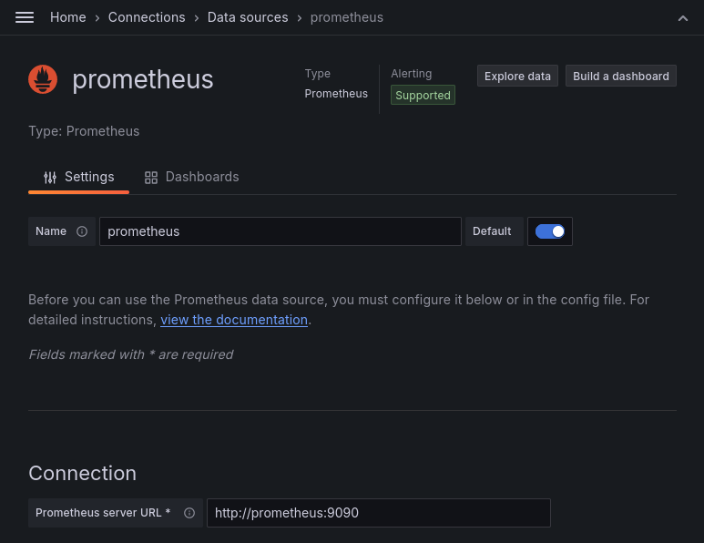
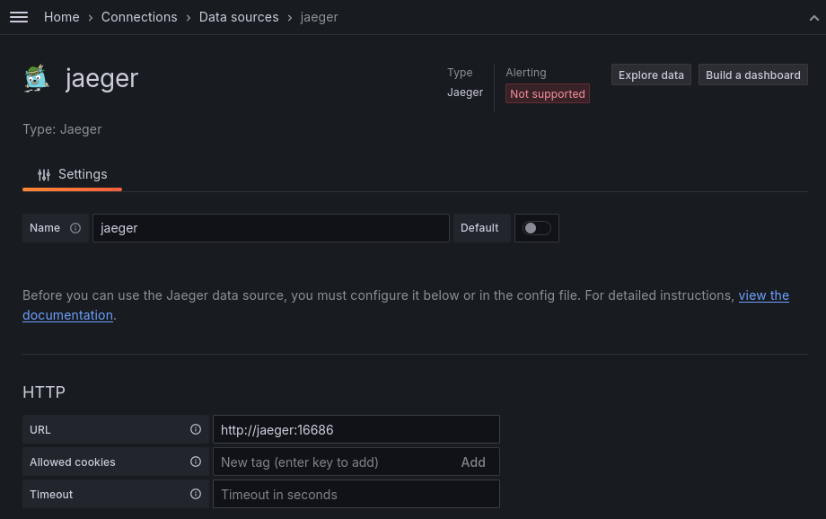
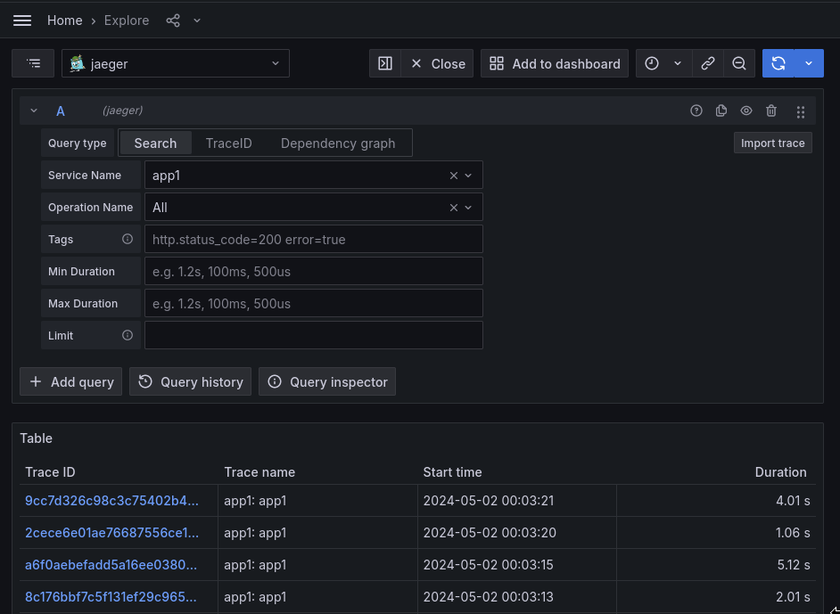
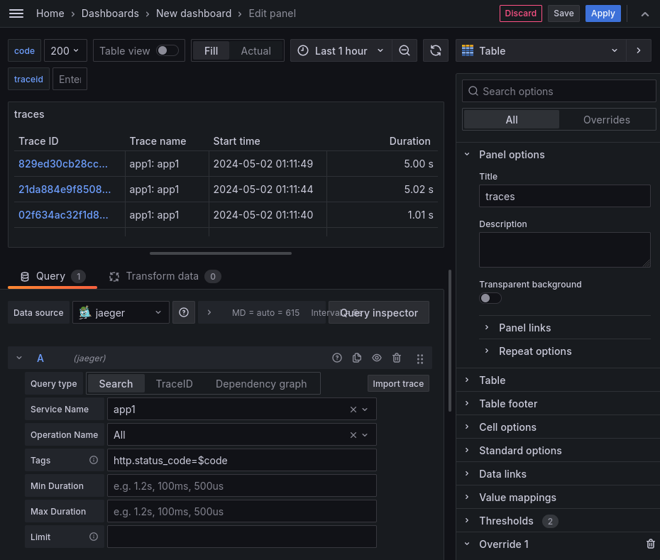
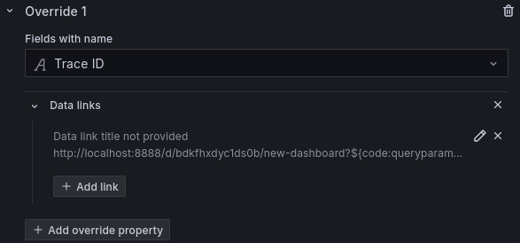
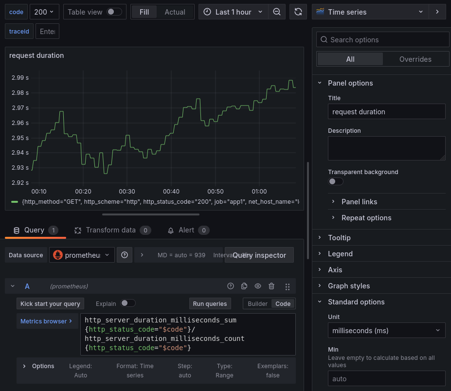

# Opentelemetry Instrumentation
В данном практическом занятии опробуем инструментирование приложения с помощью
библиотек [opentelemetry][] для языка golang.

## Vagrant
Для работы будем использовать следующий `Vagrantfile`:
```ruby
Vagrant.configure("2") do |config|
  config.vm.define "otel" do |c|
    c.vm.box = "ubuntu/lunar64"
    c.vm.hostname = "otel"
    c.vm.network "forwarded_port", guest: 8888, host: 8888
    c.vm.provision "shell", inline: <<-SHELL
      apt-get update -q
      apt-get install -yq docker.io docker-compose-v2
      usermod -a -G docker vagrant
    SHELL
  end
end
```

Данная конфигурация установит на виртуальную машину [docker][] и
[docker compose][docker-compose], с помощью которых в дальнейшем будут
развернуты остальные компоненты.

## Collector
Развернем коллектор и компоненты для телеметрии при помощи [docker-compose][],
для этого зададим конфигурацию в файл `config.yaml`:
```yaml
receivers:
  otlp:
    protocols:
      grpc:
        endpoint: 0.0.0.0:4317

processors:
  batch:

exporters:
  debug:
    verbosity: detailed
  otlp:
    endpoint: jaeger:4317
    tls:
      insecure: true
  prometheusremotewrite:
    endpoint: http://prometheus:9090/api/v1/write

service:
  pipelines:
    logs:
      receivers: [otlp]
      processors: [batch]
      exporters: [debug]
    metrics:
      receivers: [otlp]
      processors: [batch]
      exporters: [prometheusremotewrite,debug]
    traces:
      receivers: [otlp]
      processors: [batch]
      exporters: [otlp,debug]
```

И сам `compose.yaml`:
```yaml
services:
  otel-collector:
    container_name: collector
    image: otel/opentelemetry-collector-contrib:0.86.0
    ports:
    - 4317:4317
    configs:
    - source: collector
      target: /etc/otelcol-contrib/config.yaml
  prometheus:
    container_name: prometheus
    image: prom/prometheus:v2.50.1
    command:
    - --config.file=/etc/prometheus/prometheus.yml
    - --storage.tsdb.path=/prometheus
    - --web.enable-remote-write-receiver
    ports:
    - 9090:9090
  jaeger:
    container_name: jaeger
    image: jaegertracing/all-in-one:1.56
    ports:
    - "16686:16686"
  grafana:
    container_name: grafana
    image: grafana/grafana:10.4.0
    ports:
    - 8888:3000

configs:
  collector:
    file: ./config.yaml
```

После чего запустим:
```console
$ docker compose up -d
[+] Running 5/5
 ✔ Network vagrant_default  Created                                        0.0s
 ✔ Container collector      Started                                        0.5s
 ✔ Container prometheus     Started                                        0.5s
 ✔ Container jaeger         Started                                        0.6s
 ✔ Container grafana        Started                                        0.6s
```

Мы получим работающий коллектор с конфигурацией, отправляющей метрики и трейсы
в `prometheus` и `jaeger` соответственно, а также `grafana`, с помощью которой
сможем визуализировать информацию в них.

## Application
Добавим приложение, которое будет обрабатывать `http` запросы и, используя
библиотеки opentelemetry, собирать метрики и трейсы, после чего отправлять их
в коллектор. Приложение взято из занятия по `jaeger`, дополненное метриками:
```golang
package main

import (
        "context"
        "fmt"
        "io"
        "log"
        "math/rand"
        "net/http"
        "os"
        "strings"
        "time"

        "go.opentelemetry.io/contrib/instrumentation/net/http/otelhttp"
        "go.opentelemetry.io/otel"
        "go.opentelemetry.io/otel/codes"
        "go.opentelemetry.io/otel/exporters/otlp/otlpmetric/otlpmetricgrpc"
        "go.opentelemetry.io/otel/exporters/otlp/otlptrace/otlptracegrpc"
        "go.opentelemetry.io/otel/metric"
        "go.opentelemetry.io/otel/propagation"
        "go.opentelemetry.io/otel/sdk/resource"
        sdktrace "go.opentelemetry.io/otel/sdk/trace"
        sdkmetric "go.opentelemetry.io/otel/sdk/metric"
        semconv "go.opentelemetry.io/otel/semconv/v1.24.0"
        "go.opentelemetry.io/otel/trace"
        "google.golang.org/grpc"
        "google.golang.org/grpc/credentials/insecure"
)

func main() {
        service := os.Getenv("NAME")
        ctx := context.Background()

        conn, err := grpc.NewClient("collector:4317",
                grpc.WithTransportCredentials(insecure.NewCredentials()),
        )
        if err != nil {
                log.Fatal("connect to collector", err)
        }

        tr, err := initTracer(ctx, conn, service)
        if err != nil {
                log.Fatal("init tracer", err)
        }

        _, err = initMeter(ctx, conn, service)
        if err != nil {
                log.Fatal("init meter", err)
        }

        http.Handle("/", newHandler(service, tr))
        http.ListenAndServe(":8080", nil)
}

func initTracer(ctx context.Context, conn *grpc.ClientConn, svc string) (trace.Tracer, error) {
        exp, err := otlptracegrpc.New(ctx, otlptracegrpc.WithGRPCConn(conn))
        if err != nil {
                return nil, err
        }

        res, err := resource.New(ctx,
                resource.WithAttributes(
                        semconv.ServiceName(svc),
                ),
        )
        if err != nil {
                return nil, err
        }

        prv := sdktrace.NewTracerProvider(
                sdktrace.WithBatcher(exp),
                sdktrace.WithResource(res),
        )

        otel.SetTracerProvider(prv)
        otel.SetTextMapPropagator(propagation.NewCompositeTextMapPropagator(propagation.TraceContext{}, propagation.Baggage{}))

        return prv.Tracer("tracer"), nil
}

func initMeter(ctx context.Context, conn *grpc.ClientConn, svc string) (metric.MeterProvider, error) {
        exp, err := otlpmetricgrpc.New(ctx, otlpmetricgrpc.WithGRPCConn(conn))
        if err != nil {
                return nil, err
        }

        res, err := resource.New(ctx,
                resource.WithAttributes(
                        semconv.ServiceName(svc),
                ),
        )
        if err != nil {
                return nil, err
        }

        mp := sdkmetric.NewMeterProvider(
                sdkmetric.WithResource(res),
                sdkmetric.WithReader(sdkmetric.NewPeriodicReader(exp)),
        )
        otel.SetMeterProvider(mp)

        return mp, nil
}

func sendReq(ctx context.Context, tr trace.Tracer, url string) error {
        client := http.Client{Transport: otelhttp.NewTransport(http.DefaultTransport)}
        req, err := http.NewRequestWithContext(ctx, http.MethodGet, url, nil)
        if err != nil {
                return err
        }

        resp, err := client.Do(req)
        if err != nil {
                return err
        }

        defer resp.Body.Close()
        io.ReadAll(resp.Body)

        if resp.StatusCode != http.StatusOK {
                return fmt.Errorf("response code: %d", resp.StatusCode)
        }

        return nil
}

func newHandler(name string, tr trace.Tracer) http.Handler {
        return otelhttp.NewHandler(http.HandlerFunc(func(w http.ResponseWriter, r *http.Request) {
                ctx := r.Context()
                log.Printf("request %s\n", r.URL.Path)

                path := strings.Split(r.URL.Path, "/")
                if len(path) > 1 && len(path[1]) > 0 {
                        log.Printf("send request to %s\n", path[1])
                        if err := sendReq(ctx, tr,
                                fmt.Sprintf(
                                        "http://%s:8080/%s", path[1], strings.Join(path[2:], "/"),
                                )); err != nil {
                                log.Printf("send request error %s", err)
                                span := trace.SpanFromContext(ctx)
                                span.SetStatus(codes.Error, "error span")
                                span.RecordError(fmt.Errorf("error span"))
                        }
                }

                num := rand.Intn(5) + 1
                time.Sleep(time.Duration(num) * time.Second)
                if num%3 == 0 {
                        w.WriteHeader(http.StatusInternalServerError)
                }
        }), name)
}
```

Добавим его в `compose.yaml`:
```yaml
services:
  app1:
    container_name: app1
    image: app
    build: .
    environment:
    - NAME=app1
    ports:
    - "8080:8080"
  otel-collector:
    container_name: collector
    image: otel/opentelemetry-collector-contrib:0.86.0
    ports:
    - 4317:4317
    configs:
    - source: collector
      target: /etc/otelcol-contrib/config.yaml
  prometheus:
    container_name: prometheus
    image: prom/prometheus:v2.50.1
    command:
    - --config.file=/etc/prometheus/prometheus.yml
    - --storage.tsdb.path=/prometheus
    - --web.enable-remote-write-receiver
    ports:
    - 9090:9090
  jaeger:
    container_name: jaeger
    image: jaegertracing/all-in-one:1.56
    ports:
    - "16686:16686"
  grafana:
    container_name: grafana
    image: grafana/grafana:10.4.0
    ports:
    - 8888:3000

configs:
  collector:
    file: ./config.yaml
```
Запустим контейнер и цикл запросов, чтобы наше приложение начало отправлять
метрики и трейсы в коллектор:
```console
$ docker compose up -d
[+] Running 6/6
 ✔ Network vagrant_default  Created                                        0.0s
 ✔ Container app1           Started                                        0.8s
 ✔ Container prometheus     Started                                        0.5s
 ✔ Container collector      Started                                        0.7s
 ✔ Container jaeger         Started                                        0.7s
 ✔ Container grafana        Started                                        0.8s
$ while :;do curl localhost:8080;done
```

## Visualization
По адресу [localhost:8888](http://localhost:8888) доступен интерфейс
[grafana][]. Авторизуемся под учетными данными `admin:admin` и перейдем в раздел
[datasources](http://localhost:8888/connections/datasources).

### Metrics
В нем добавим в качестве источника метрик [prometheus][]:



После чего нажмем кнопку `Save & test` и перейдем в `Explore data`. В данном
разделе можем сделать поиск по метрике `http_server_duration_milliseconds_count`,
чтобы убедиться, что метрики нашего приложения попадают в хранилище:


Как видно, метрики сервера автоматически сгенерированы библиотекой
инструментирования [opentelemetry][] при обработке http запросов.

### Traces
Добавим еще один датасорс [jaeger][] для трейсов:



После сохранения также перейдем в `Explore data`, чтобы увидеть трейсы нашего
приложения:




Как видно, библиотека инструментирования [opentelemetry][] добавляет информацию
о запросе в атрибуты спана.

### Dashboard
Создадим новый дашборд в разделе [dashboards](http://localhost:8888/dashboards).
Добавим в него переменную `code` для выбора http кода в метриках и трейсах:


И добавим переменную для выбора `traceid`:


После чего добавим визуализацию для трейсов как ранее делали в практике по
`jaeger`, добавив переменную в теги:



И также добавив override для выбора `traceid`:




А также добавим визуализации с деталями по трейсу:


Добавим на дашборд метрики для отображения частоты запросов:


И среднее время запросов:



После чего с помощью переменных мы можем манипулировать данными в наших
визуализациях для удобного анализа проблем в приложении:


[opentelemetry]:https://opentelemetry.io/docs/what-is-opentelemetry/
[golang]:https://go.dev/
[docker]:https://docs.docker.com/engine/
[docker-compose]:https://docs.docker.com/compose/
[grafana]:https://grafana.com/docs/grafana/latest/introduction/
[prometheus]:https://prometheus.io/docs/introduction/overview/
[jaeger]:https://www.jaegertracing.io/docs/1.56/
