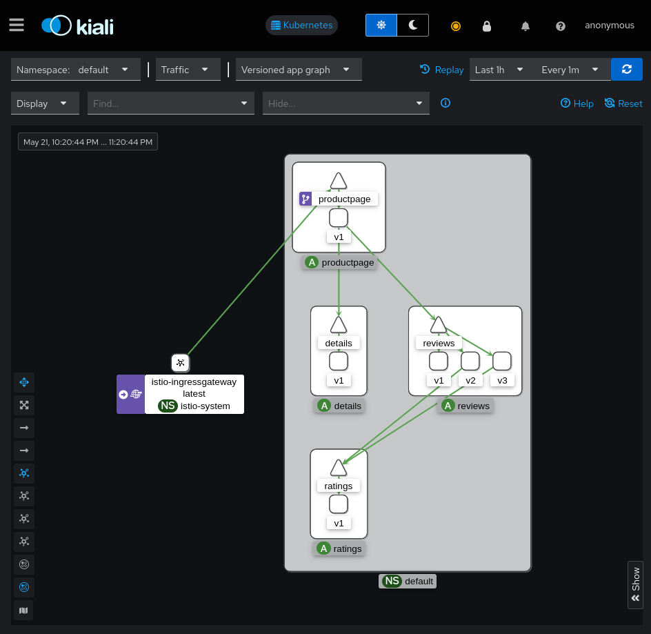
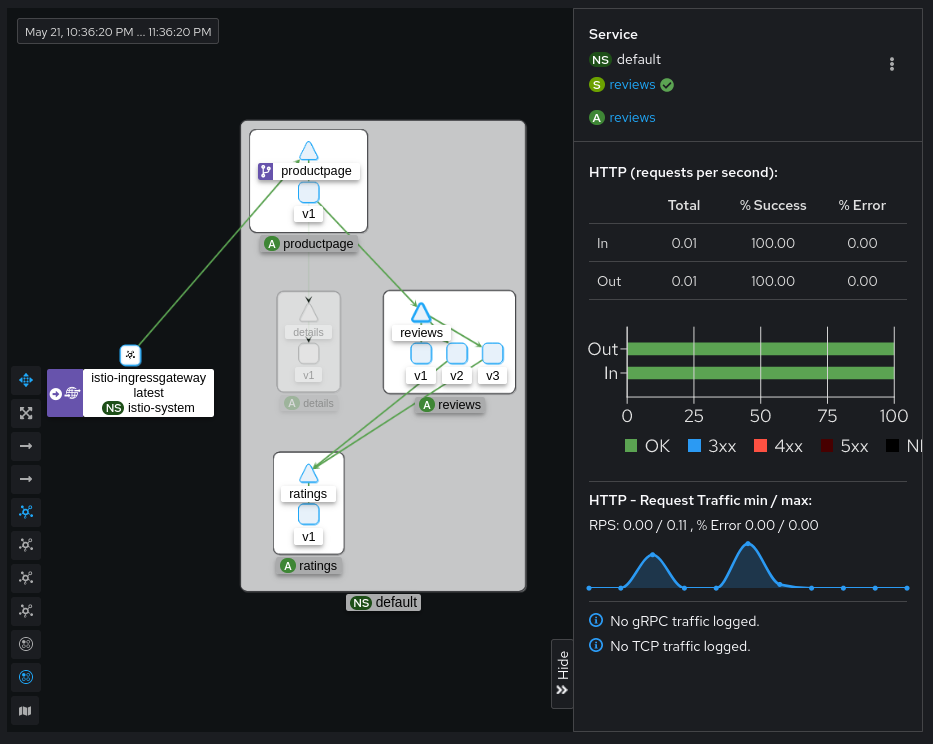
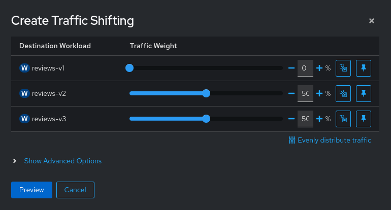

# Kiali

## Vagrant
Для работы будем использовать следующий `Vagrantfile`:
```ruby
Vagrant.configure("2") do |config|
  config.vm.define "otel" do |c|
    c.vm.provider "virtualbox" do |v|
      v.cpus = 2
      v.memory = 4096
    end
    c.vm.box = "ubuntu/lunar64"
    c.vm.hostname = "otel"
    c.vm.network "forwarded_port", guest: 8080, host: 8888
    c.vm.provision "shell", inline: <<-SHELL
      apt-get update -q
      apt-get install -yq docker.io docker-compose-v2
      usermod -a -G docker vagrant
      curl -LO https://dl.k8s.io/release/v1.30.0/bin/linux/amd64/kubectl
      curl -Lo ./kind https://kind.sigs.k8s.io/dl/v0.22.0/kind-linux-amd64
      curl -L https://github.com/istio/istio/releases/download/1.21.2/istioctl-1.21.2-linux-amd64.tar.gz \
        | tar xzf - -C /usr/local/bin/
      install -m 755 kubectl kind /usr/local/bin/
      rm kubectl kind
    SHELL
  end
end
```
Данная конфигурация установит на виртуальную машину [docker][], [kubectl][] и [kind][],
с помощью которых будет производиться развертывание и управление кластером
[kubernetes][], а также утилита [istioctl][] для управления [istio][].


## Install
Создадим новый кластер с помощью утилиты `kind` передав конфигурацию, в которой
указаны дополнительные порты для доступа снаружи:
```bash
cat <<EOF | kind create cluster --config=-
kind: Cluster
apiVersion: kind.x-k8s.io/v1alpha4
nodes:
- role: control-plane
  kubeadmConfigPatches:
  - |
    kind: InitConfiguration
    nodeRegistration:
      kubeletExtraArgs:
        node-labels: "ingress-ready=true"
  extraPortMappings:
  - containerPort: 8080
    hostPort: 8080
    protocol: TCP
  - containerPort: 8443
    hostPort: 8443
    protocol: TCP
EOF
```
И убедимся что он функционирует:
```console
Creating cluster "kind" ...
 ✓ Ensuring node image (kindest/node:v1.29.2) 🖼
 ✓ Preparing nodes 📦
 ✓ Writing configuration 📜
 ✓ Starting control-plane 🕹️
 ✓ Installing CNI 🔌
 ✓ Installing StorageClass 💾
Set kubectl context to "kind-kind"
You can now use your cluster with:

kubectl cluster-info --context kind-kind

Not sure what to do next? 😅  Check out https://kind.sigs.k8s.io/docs/user/quick-start/

$ kubectl cluster-info
Kubernetes control plane is running at https://127.0.0.1:34283
CoreDNS is running at https://127.0.0.1:34283/api/v1/namespaces/kube-system/services/kube-dns:dns/proxy

To further debug and diagnose cluster problems, use 'kubectl cluster-info dump'.
```

Установим [istio][] с помощью [istioctl][], добавим метку на неймспейс, чтобы
[istio][] мог инжектить сайдкары, а также внесем изменения в конфигурацию
`istio-ingressgateway` для доступа снаружи:

```console
$ istioctl install --set profile=demo -y
✔ Istio core installed
✔ Istiod installed
✔ Egress gateways installed
✔ Ingress gateways installed
✔ Installation complete
Made this installation the default for injection and validation.
$ kubectl label namespace default istio-injection=enabled
namespace/default labeled
$ kubectl patch deploy -n istio-system istio-ingressgateway -p '{"spec":{"template":{"spec":{"dnsPolicy":"ClusterFirstWithHostNet","hostNetwork":true}}}}'
deployment.apps/istio-ingressgateway patched
```

## Deploy Kiali
Установим тестовое приложение [bookinfo][], а также [prometheus][] и [kiali][]:
```console
$ kubectl apply -f https://raw.githubusercontent.com/istio/istio/release-1.21/samples/bookinfo/platform/kube/bookinfo.yaml
service/details created
serviceaccount/bookinfo-details created
deployment.apps/details-v1 created
service/ratings created
serviceaccount/bookinfo-ratings created
deployment.apps/ratings-v1 created
service/reviews created
serviceaccount/bookinfo-reviews created
deployment.apps/reviews-v1 created
deployment.apps/reviews-v2 created
deployment.apps/reviews-v3 created
service/productpage created
serviceaccount/bookinfo-productpage created
deployment.apps/productpage-v1 created

$ kubectl apply -f https://raw.githubusercontent.com/istio/istio/release-1.21/samples/bookinfo/networking/bookinfo-gateway.yaml
gateway.networking.istio.io/bookinfo-gateway created
virtualservice.networking.istio.io/bookinfo created

$ kubectl apply -f https://raw.githubusercontent.com/istio/istio/release-1.22/samples/addons/prometheus.yaml
serviceaccount/prometheus created
configmap/prometheus created
clusterrole.rbac.authorization.k8s.io/prometheus created
clusterrolebinding.rbac.authorization.k8s.io/prometheus created
service/prometheus created
deployment.apps/prometheus created

$ kubectl apply -f https://raw.githubusercontent.com/istio/istio/release-1.22/samples/addons/kiali.yaml
serviceaccount/kiali created
configmap/kiali created
clusterrole.rbac.authorization.k8s.io/kiali-viewer created
clusterrole.rbac.authorization.k8s.io/kiali created
clusterrolebinding.rbac.authorization.k8s.io/kiali created
role.rbac.authorization.k8s.io/kiali-controlplane created
rolebinding.rbac.authorization.k8s.io/kiali-controlplane created
service/kiali created
deployment.apps/kiali created

```

Для доступа снаружи добавим `VirtualService`:
```bash
kubectl apply -f - <<EOF
apiVersion: networking.istio.io/v1beta1
kind: VirtualService
metadata:
  name: kiali
spec:
  gateways:
  - bookinfo-gateway
  hosts:
  - kiali.127.0.0.1.nip.io
  http:
  - route:
    - destination:
        host: kiali.istio-system.svc.cluster.local
        port:
          number: 20001
EOF
```

После чего будет доступен интерфейс [kiali][] по адресу
[kiali.127.0.0.1.nip.io:8888](http://kiali.127.0.0.1.nip.io:8888).


А также демонстрационное приложение [bookinfo][], которое можно открыть по адресу
[localhost:8888/productpage][productpage].


## Graph
Сделаем несколько запросов в тестовое приложение, чтобы появились метрики
проходящего трафика. После прохождения трафика на странице [Traffic Graph][graph]
можно увидеть схему взаимодействий между сервисами:



Как видно, трафик заходит через `istio-ingressgateway` и попадает в сервис
`productpage`, после чего с данного сервиса отправляются запросы в сервисы
`details` и `reviews`, а с сервиса `reviews` уходит в `ratings`. Причем
сервис `ratings` запрашивается только из сервиса `reviews` с версиями `v2` и `v3`.

Выберем сервис `reviews` на графе, в правой панели можно увидеть информацию
о трафике прошедшем через данный сервис:



Здесь можно наблюдать количество запросов в секунду, а также http коды ответов.

В интерфейсе [kiali][] можно не только наблюдать за трафиком в [istio][],
но и также производить некоторые изменения.

## Traffic Shifting
С помощью [kiali][] можно управлять процентным соотношением трафика между разными
группами сервиса, для этого перейдем в конфигурацию сервиса [reviews][]:


Здесь в `Actions` выберем `Traffic Shifting`:


И в появившемся меню выставим соотношение по версиям в процентах так, чтобы
на версию `v1` трафик не поступал:



Нажмем кнопку `Preview` в которой отобразятся создаваемые ресурсы [istio][] и
после кнопку `Create`

Теперь при попытках открытия страницы [productpage][] будет отображаться блок
`Book Reviews` только версий `v2` и `v3`:

 

После того, как убедились, что версия `v1` не появляется, можем удалить в
интерфейсе [kiali][] данную конфигурацию в меню
`Actions` - `Delete Traffic Routing`, после чего снова сможем попадать на `v1`:


## Fault Injection
Для тестирования работы микросервисной системы [istio][] позволяет добавлять
ошибки во взаимодействие между сервисами.
Попробуем добавить ошибку от сервиса [reviews][], для этого на
странице сервиса выберем `Actions` - `Fault Injection`, после чего в появившемся
меню выберем тип ошибки - ответ 503 и процент возникновения - 50:


После чего по кнопке `Preview` можем наблюдать создаваемые ресурсы [istio][]
и по кнопке `Create` применим их. Теперь открывая страницу [productpage][]
иногда блок `Product Reviews` не будет отображаться:


Таким образом можно убедиться насколько система устойчива к сбоям отдельных
сервисов.

[istio]:https://istio.io/latest/about/service-mesh/
[kubernetes]:https://kubernetes.io/ru/
[docker]:https://docs.docker.com/engine/
[kubectl]:https://kubernetes.io/ru/docs/reference/kubectl/kubectl/
[kind]:https://kind.sigs.k8s.io/
[istioctl]:https://istio.io/latest/docs/reference/commands/istioctl/
[bookinfo]:https://istio.io/latest/docs/examples/bookinfo/
[prometheus]:https://prometheus.io/
[kiali]:https://kiali.io/
[graph]:http://kiali.127.0.0.1.nip.io:8888/kiali/console/graph/namespaces/?traffic=grpc%2CgrpcRequest%2Chttp%2ChttpRequest%2Ctcp%2CtcpSent&graphType=versionedApp&namespaces=default&duration=3600&refresh=60000&layout=kiali-dagre&namespaceLayout=kiali-breadthfirst
[reviews]:http://kiali.127.0.0.1.nip.io:8888/kiali/console/namespaces/default/services/reviews?duration=3600&refresh=60000
[productpage]:http://localhost:8888/productpage
