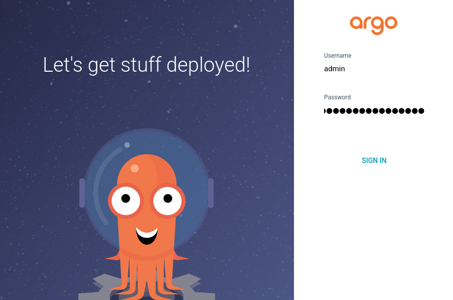
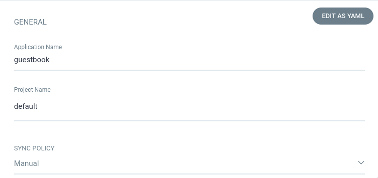
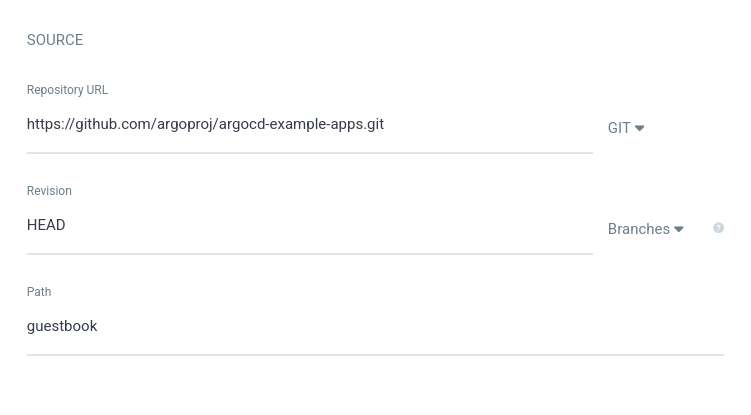
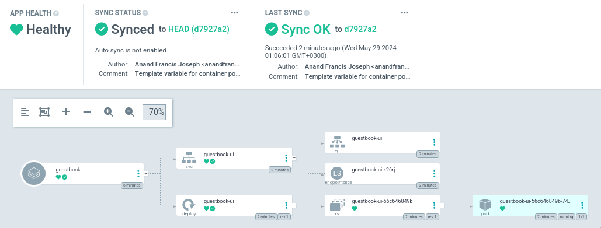
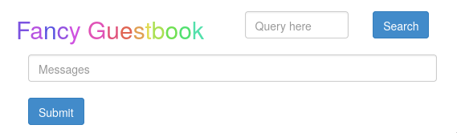

# ArgoCD
В данном практическом занятии познакомимся с инструментом доставки приложений -
[argocd][].

## Vagrant
Для работы будем использовать следующий `Vagrantfile`:
```ruby
Vagrant.configure("2") do |config|
  config.vm.define "otel" do |c|
    c.vm.provider "virtualbox" do |v|
      v.cpus = 2
      v.memory = 4096
    end
    c.vm.box = "ubuntu/lunar64"
    c.vm.hostname = "otel"
    c.vm.network "forwarded_port", guest: 80, host: 8888
    c.vm.provision "shell", inline: <<-SHELL
      apt-get update -q
      apt-get install -yq docker.io docker-compose-v2
      usermod -a -G docker vagrant
      curl -LO https://dl.k8s.io/release/v1.30.0/bin/linux/amd64/kubectl
      curl -Lo ./kind https://kind.sigs.k8s.io/dl/v0.22.0/kind-linux-amd64
      curl -Lo ./argocd https://github.com/argoproj/argo-cd/releases/download/v2.11.2/argocd-linux-amd64
      install -m 755 kubectl kind argocd /usr/local/bin/
      rm kubectl kind argocd
    SHELL
  end
end
```
Данная конфигурация установит на виртуальную машину [docker][], [kubectl][] и
[kind][], с помощью которых будет производиться развертывание и управление 
кластером [kubernetes][], а также утилита `argocd` для управления [argocd][].

## Install
Создадим новый кластер с помощью утилиты `kind` передав конфигурацию, в которой
указаны дополнительные порты для доступа снаружи:
```bash
cat <<EOF | kind create cluster --config=-
kind: Cluster
apiVersion: kind.x-k8s.io/v1alpha4
nodes:
- role: control-plane
  kubeadmConfigPatches:
  - |
    kind: InitConfiguration
    nodeRegistration:
      kubeletExtraArgs:
        node-labels: "ingress-ready=true"
  extraPortMappings:
  - containerPort: 80
    hostPort: 80
    protocol: TCP
  - containerPort: 443
    hostPort: 443
    protocol: TCP
EOF
```
И убедимся что он функционирует:
```console
Creating cluster "kind" ...
 ✓ Ensuring node image (kindest/node:v1.29.2) 🖼
 ✓ Preparing nodes 📦
 ✓ Writing configuration 📜
 ✓ Starting control-plane 🕹️
 ✓ Installing CNI 🔌
 ✓ Installing StorageClass 💾
Set kubectl context to "kind-kind"
You can now use your cluster with:

kubectl cluster-info --context kind-kind

Not sure what to do next? 😅  Check out https://kind.sigs.k8s.io/docs/user/quick-start/
$ kubectl cluster-info
Kubernetes control plane is running at https://127.0.0.1:34853
CoreDNS is running at https://127.0.0.1:34853/api/v1/namespaces/kube-system/services/kube-dns:dns/proxy

To further debug and diagnose cluster problems, use 'kubectl cluster-info dump'.
```

Создадим неймспейс и установим в него [argocd][]:
```console
$ kubectl create namespace argocd
namespace/argocd created
$ kubectl apply -n argocd -f https://raw.githubusercontent.com/argoproj/argo-cd/stable/manifests/install.yaml
customresourcedefinition.apiextensions.k8s.io/applications.argoproj.io created
customresourcedefinition.apiextensions.k8s.io/applicationsets.argoproj.io created
customresourcedefinition.apiextensions.k8s.io/appprojects.argoproj.io created
serviceaccount/argocd-application-controller created
serviceaccount/argocd-applicationset-controller created
serviceaccount/argocd-dex-server created
serviceaccount/argocd-notifications-controller created
serviceaccount/argocd-redis created
serviceaccount/argocd-repo-server created
serviceaccount/argocd-server created
role.rbac.authorization.k8s.io/argocd-application-controller created
role.rbac.authorization.k8s.io/argocd-applicationset-controller created
role.rbac.authorization.k8s.io/argocd-dex-server created
role.rbac.authorization.k8s.io/argocd-notifications-controller created
role.rbac.authorization.k8s.io/argocd-redis created
role.rbac.authorization.k8s.io/argocd-server created
clusterrole.rbac.authorization.k8s.io/argocd-application-controller created
clusterrole.rbac.authorization.k8s.io/argocd-applicationset-controller created
clusterrole.rbac.authorization.k8s.io/argocd-server created
rolebinding.rbac.authorization.k8s.io/argocd-application-controller created
rolebinding.rbac.authorization.k8s.io/argocd-applicationset-controller created
rolebinding.rbac.authorization.k8s.io/argocd-dex-server created
rolebinding.rbac.authorization.k8s.io/argocd-notifications-controller created
rolebinding.rbac.authorization.k8s.io/argocd-redis created
rolebinding.rbac.authorization.k8s.io/argocd-server created
clusterrolebinding.rbac.authorization.k8s.io/argocd-application-controller created
clusterrolebinding.rbac.authorization.k8s.io/argocd-applicationset-controller created
clusterrolebinding.rbac.authorization.k8s.io/argocd-server created
configmap/argocd-cm created
configmap/argocd-cmd-params-cm created
configmap/argocd-gpg-keys-cm created
configmap/argocd-notifications-cm created
configmap/argocd-rbac-cm created
configmap/argocd-ssh-known-hosts-cm created
configmap/argocd-tls-certs-cm created
secret/argocd-notifications-secret created
secret/argocd-secret created
service/argocd-applicationset-controller created
service/argocd-dex-server created
service/argocd-metrics created
service/argocd-notifications-controller-metrics created
service/argocd-redis created
service/argocd-repo-server created
service/argocd-server created
service/argocd-server-metrics created
deployment.apps/argocd-applicationset-controller created
deployment.apps/argocd-dex-server created
deployment.apps/argocd-notifications-controller created
deployment.apps/argocd-redis created
deployment.apps/argocd-repo-server created
deployment.apps/argocd-server created
statefulset.apps/argocd-application-controller created
networkpolicy.networking.k8s.io/argocd-application-controller-network-policy created
networkpolicy.networking.k8s.io/argocd-applicationset-controller-network-policy created
networkpolicy.networking.k8s.io/argocd-dex-server-network-policy created
networkpolicy.networking.k8s.io/argocd-notifications-controller-network-policy created
networkpolicy.networking.k8s.io/argocd-redis-network-policy created
networkpolicy.networking.k8s.io/argocd-repo-server-network-policy created
networkpolicy.networking.k8s.io/argocd-server-network-policy created
$ kubectl patch -n argocd deploy argocd-server --type json -p '[{"op":"add","path":"/spec/template/spec/containers/0/args/-","value":"--insecure"}]'
deployment.apps/argocd-server patched
```
Также задеплоим `ingress-nginx` и создадим ресурс `ingress` для доступа к [argocd][]:
```console
$ kubectl apply -f https://raw.githubusercontent.com/kubernetes/ingress-nginx/main/deploy/static/provider/kind/deploy.yaml
namespace/ingress-nginx created
serviceaccount/ingress-nginx created
serviceaccount/ingress-nginx-admission created
role.rbac.authorization.k8s.io/ingress-nginx created
role.rbac.authorization.k8s.io/ingress-nginx-admission created
clusterrole.rbac.authorization.k8s.io/ingress-nginx created
clusterrole.rbac.authorization.k8s.io/ingress-nginx-admission created
rolebinding.rbac.authorization.k8s.io/ingress-nginx created
rolebinding.rbac.authorization.k8s.io/ingress-nginx-admission created
clusterrolebinding.rbac.authorization.k8s.io/ingress-nginx created
clusterrolebinding.rbac.authorization.k8s.io/ingress-nginx-admission created
configmap/ingress-nginx-controller created
service/ingress-nginx-controller created
service/ingress-nginx-controller-admission created
deployment.apps/ingress-nginx-controller created
job.batch/ingress-nginx-admission-create created
job.batch/ingress-nginx-admission-patch created
ingressclass.networking.k8s.io/nginx created
validatingwebhookconfiguration.admissionregistration.k8s.io/ingress-nginx-admission created
$ kubectl create ingress -n argocd argocd --rule=argo.traefik.me/*=argocd-server:80
ingress.networking.k8s.io/argocd created
```
И убедимся, что `argocd` стал доступен:
```console
$ curl argo.traefik.me -so /dev/null -w '%{http_code}'
200
```

## ArgoCD CLI
Получим временный пароль, который сгенерировался после установки:
```console
$ argocd admin initial-password -n argocd
5N8ph9wIc2UjagNq

 This password must be only used for first time login. We strongly recommend you update the password using `argocd account update-password`.
```

После чего авторизуемся под пользователем `admin`:
```console
$ argocd login argo.traefik.me
WARNING: server certificate had error: tls: failed to verify certificate: x509: certificate is valid for ingress.local, not argo.traefik.me. Proceed insecurely (y/n)? y
Username: admin
Password:
'admin:login' logged in successfully
Context 'argo.traefik.me' updated
```

Воспользуемся `argocd` для доставки тестового приложения, которое находится в
git репозитории [argocd-example-apps][], для этого выполним команду:
```console
$ argocd app create guestbook --repo https://github.com/argoproj/argocd-example-apps.git --path guestbook --dest-server https://kubernetes.default.svc --dest-namespace default
application 'guestbook' created
```
Данная команда создаст ресурс `application` в кластере, где будет указан
репозиторий [argocd-example-apps][], путь до директории `guestbook` в данном
репозитории, где находятся описания `kubernetes` ресурсов для деплоя, а также
текущий кластер и неймспейс, в которые развернется приложение.

Посмотреть информацию можно утилитой `kubectl` или `argocd`:
```console
$ kubectl get application -n argocd
NAME        SYNC STATUS   HEALTH STATUS
guestbook   OutOfSync     Missing
$ argocd app list
NAME              CLUSTER                         NAMESPACE  PROJECT  STATUS     HEALTH   SYNCPOLICY  CONDITIONS  REPO                                                 PATH       TARGET
argocd/guestbook  https://kubernetes.default.svc  default    default  OutOfSync  Missing  Manual      <none>      https://github.com/argoproj/argocd-example-apps.git  guestbook
$ argocd app get guestbook
Name:               argocd/guestbook
Project:            default
Server:             https://kubernetes.default.svc
Namespace:          default
URL:                https://argo.traefik.me/applications/guestbook
Source:
- Repo:             https://github.com/argoproj/argocd-example-apps.git
  Target:
  Path:             guestbook
SyncWindow:         Sync Allowed
Sync Policy:        Manual
Sync Status:        OutOfSync from  (d7927a2)
Health Status:      Missing

GROUP  KIND        NAMESPACE  NAME          STATUS     HEALTH   HOOK  MESSAGE
       Service     default    guestbook-ui  OutOfSync  Missing
apps   Deployment  default    guestbook-ui  OutOfSync  Missing
```

На текущий момент приложение создано, но состояние в кластере не
синхронизировано с состоянием git репозитория. Для синхронизации можно выполнить
команду:
```console
$ argocd app sync guestbook
TIMESTAMP                  GROUP        KIND   NAMESPACE                  NAME    STATUS    HEALTH        HOOK  MESSAGE
2024-05-28T21:41:35+00:00            Service     default          guestbook-ui  OutOfSync  Missing
2024-05-28T21:41:35+00:00   apps  Deployment     default          guestbook-ui  OutOfSync  Missing
2024-05-28T21:41:35+00:00            Service     default          guestbook-ui  OutOfSync  Missing              service/guestbook-ui created
2024-05-28T21:41:35+00:00   apps  Deployment     default          guestbook-ui  OutOfSync  Missing              deployment.apps/guestbook-ui created
2024-05-28T21:41:35+00:00            Service     default          guestbook-ui    Synced  Healthy                  service/guestbook-ui created
2024-05-28T21:41:35+00:00   apps  Deployment     default          guestbook-ui    Synced  Progressing              deployment.apps/guestbook-ui created

Name:               argocd/guestbook
Project:            default
Server:             https://kubernetes.default.svc
Namespace:          default
URL:                https://argo.traefik.me/applications/guestbook
Source:
- Repo:             https://github.com/argoproj/argocd-example-apps.git
  Target:
  Path:             guestbook
SyncWindow:         Sync Allowed
Sync Policy:        Manual
Sync Status:        Synced to  (d7927a2)
Health Status:      Progressing

Operation:          Sync
Sync Revision:      d7927a27b4533926b7d86b5f249cd9ebe7625e90
Phase:              Succeeded
Start:              2024-05-28 21:41:34 +0000 UTC
Finished:           2024-05-28 21:41:35 +0000 UTC
Duration:           1s
Message:            successfully synced (all tasks run)

GROUP  KIND        NAMESPACE  NAME          STATUS  HEALTH       HOOK  MESSAGE
       Service     default    guestbook-ui  Synced  Healthy            service/guestbook-ui created
apps   Deployment  default    guestbook-ui  Synced  Progressing        deployment.apps/guestbook-ui created
```

Через некоторое время все ресурсы развернутся и будут находиться в статусе
`Healthy`:
```console
$ argocd app get guestbook
Name:               argocd/guestbook
Project:            default
Server:             https://kubernetes.default.svc
Namespace:          default
URL:                https://argo.traefik.me/applications/guestbook
Source:
- Repo:             https://github.com/argoproj/argocd-example-apps.git
  Target:
  Path:             guestbook
SyncWindow:         Sync Allowed
Sync Policy:        Manual
Sync Status:        Synced to  (d7927a2)
Health Status:      Healthy

GROUP  KIND        NAMESPACE  NAME          STATUS  HEALTH   HOOK  MESSAGE
       Service     default    guestbook-ui  Synced  Healthy        service/guestbook-ui created
apps   Deployment  default    guestbook-ui  Synced  Healthy        deployment.apps/guestbook-ui created

$ kubectl get deploy,svc,pod
NAME                           READY   UP-TO-DATE   AVAILABLE   AGE
deployment.apps/guestbook-ui   1/1     1            1           2m33s

NAME                   TYPE        CLUSTER-IP     EXTERNAL-IP   PORT(S)   AGE
service/guestbook-ui   ClusterIP   10.96.187.88   <none>        80/TCP    2m33s

NAME                                READY   STATUS    RESTARTS   AGE
pod/guestbook-ui-56c646849b-j7wf2   1/1     Running   0          2m33s
```
Добавим также ресурс `ingress` для доступа к приложению `guestbook-ui`:
```console
$ kubectl create ingress guestbook-ui --rule=guestbook.traefik.me/*=guestbook-ui:80
ingress.networking.k8s.io/guestbook-ui created
$ curl -s guestbook.traefik.me | grep title
    <title>Guestbook</title>
```

После чего можем удалить приложение:
```console
$ argocd app delete guestbook
Are you sure you want to delete 'guestbook' and all its resources? [y/n] y
application 'guestbook' deleted
$ kubectl get pod
No resources found in default namespace.
$ curl -s guestbook.traefik.me | grep title
<head><title>503 Service Temporarily Unavailable</title></head>
```

## ArgoCD UI
В [argocd][] также есть удобный web интерфейс, который будет доступен по адресу
[argo.traefik.me:8888](http://argo.traefik.me:8888/). Авторизуемся в нем под
пользователем `admin` и паролем, который получили после инсталляции:



После чего проделаем в нем тот же путь, что сделали с помощью `cli`.
Нажмем `Create Application` и заполним основные поля:



В источнике укажем репозиторий
[https://github.com/argoproj/argocd-example-apps.git][argocd-example-apps]
и путь до директории `guestbook`:



А в качестве `destination` укажем наш текущий кластер и неймспейс `default`:


После чего нажмем кнопку `Create` и увидим состояние нашего приложения:


Нажав на кнопку `Sync` и далее `Synchronize` запустится синхронизация ресурсов
в кластере с git репозиторием:



После чего по адресу [guestbook.traefik.me:8888](http://guestbook.traefik.me:8888/)
будет доступно данное приложение:



[argocd]:https://argo-cd.readthedocs.io/en/stable/
[kubernetes]:https://kubernetes.io/ru/
[docker]:https://docs.docker.com/engine/
[kubectl]:https://kubernetes.io/ru/docs/reference/kubectl/kubectl/
[kind]:https://kind.sigs.k8s.io/
[argocd-example-apps]:https://github.com/argoproj/argocd-example-apps.git
